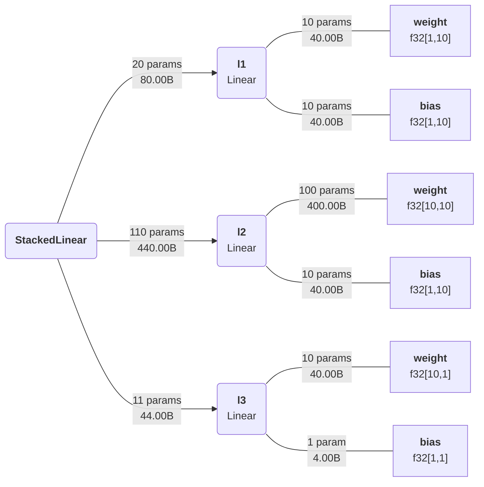
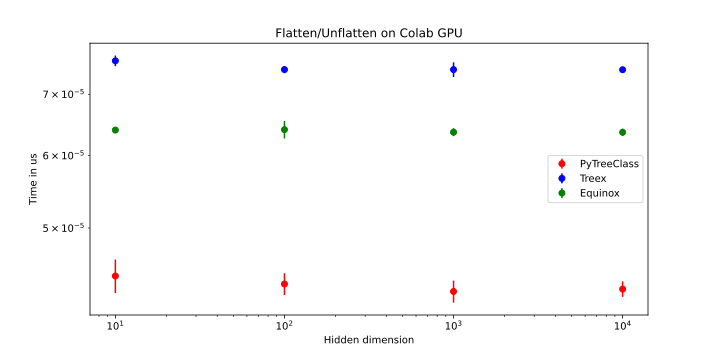

<!-- <h1 align="center" style="font-family:Monospace" >Py🌲Class</h1> -->
<h5 align="center">
 <br>

<br>

[**Installation**](#Installation)
|[**Description**](#Description)
|[**Quick Example**](#QuickExample)
|[**Filtering**](#Filtering)
|[**StatefulComputation**](#StatefulComputation)
|[**Applications**](#Applications)|
[**Acknowledgements**](#Acknowledgements)

<!-- |[**Benchmarking**](#Benchmarking) -->


[](https://colab.research.google.com/drive/1bkYr-5HidtRSXFFBlvYqFa5pc5fQK_7-?usp=sharing)
[](https://pepy.tech/project/pytreeclass)
[](https://codecov.io/gh/ASEM000/pytreeclass)
[](https://pytreeclass.readthedocs.io/en/latest/?badge=latest)

[](https://zenodo.org/badge/latestdoi/512717921)


</h5>

## 🛠️ Installation<a id="Installation"></a>

```python
pip install pytreeclass
```

**Install development version**

```python
pip install git+https://github.com/ASEM000/PyTreeClass
```

## 📖 Description<a id="Description"></a>

`PyTreeClass` is a JAX-compatible `dataclass`-like decorator to create and operate on stateful JAX PyTrees.

The package aims to achieve _two goals_:

1. 🔒 To maintain safe and correct behaviour by using _immutable_ modules with _functional_ API.
2. To achieve the **most intuitive** user experience in the `JAX` ecosystem by :
   - 🏗️ Defining layers similar to `PyTorch` or `TensorFlow` subclassing style.
   - ☝️ Filtering\Indexing layer values by using boolean masking similar to `jax.numpy.at[].{get,set,apply,...}`
   - 🎨 Visualize defined layers in plethora of ways for better debugging and sharing of information.

## ⏩ Quick Example <a id="QuickExample">

### 🏗️ Create simple MLP <a id="Pytorch">

```python
import jax
from jax import numpy as jnp
import pytreeclass as pytc
import matplotlib.pyplot as plt

@pytc.treeclass
class Linear :
   # Any variable not wrapped with @pytc.treeclass
   # should be declared as a dataclass field here
   weight : jnp.ndarray
   bias   : jnp.ndarray

   def __init__(self,key,in_dim,out_dim):
       self.weight = jax.random.normal(key,shape=(in_dim, out_dim)) * jnp.sqrt(2/in_dim)
       self.bias = jnp.ones((1,out_dim))

   def __call__(self,x):
       return x @ self.weight + self.bias

@pytc.treeclass
class StackedLinear:

    def __init__(self,key,in_dim,out_dim,hidden_dim):
        keys= jax.random.split(key,3)

        # Declaring l1,l2,l3 as dataclass_fields is optional
        # as l1,l2,l3 are Linear class that is already wrapped with @pytc.treeclass
        self.l1 = Linear(key=keys[0],in_dim=in_dim,out_dim=hidden_dim)
        self.l2 = Linear(key=keys[1],in_dim=hidden_dim,out_dim=hidden_dim)
        self.l3 = Linear(key=keys[2],in_dim=hidden_dim,out_dim=out_dim)

    def __call__(self,x):
        x = self.l1(x)
        x = jax.nn.tanh(x)
        x = self.l2(x)
        x = jax.nn.tanh(x)
        x = self.l3(x)

        return x

model = StackedLinear(in_dim=1,out_dim=1,hidden_dim=10,key=jax.random.PRNGKey(0))

x = jnp.linspace(0,1,100)[:,None]
y = x**3 + jax.random.uniform(jax.random.PRNGKey(0),(100,1))*0.01
```

### 🎨 Visualize<a id="Viz">

<details>

<div align="center">
<table>
<tr>
 <td align = "center"> summary </td> <td align = "center">tree_box</td><td align = "center">tree_diagram</td>
</tr>
<tr>
 
<td>

```python
print(model.summary())
┌────┬──────┬───────┬──────────────┬─────────────────┐
│Name│Type  │Param #│Size          │Config           │
├────┼──────┼───────┼──────────────┼─────────────────┤
│l1  │Linear│20(0)  │80.00B(0.00B) │weight=f32[1,10] │
│    │      │       │              │bias=f32[1,10]   │
├────┼──────┼───────┼──────────────┼─────────────────┤
│l2  │Linear│110(0) │440.00B(0.00B)│weight=f32[10,10]│
│    │      │       │              │bias=f32[1,10]   │
├────┼──────┼───────┼──────────────┼─────────────────┤
│l3  │Linear│11(0)  │44.00B(0.00B) │weight=f32[10,1] │
│    │      │       │              │bias=f32[1,1]    │
└────┴──────┴───────┴──────────────┴─────────────────┘
Total count :	141(0)
Dynamic count :	141(0)
Frozen count :	0(0)
------------------------------------------------------
Total size :	564.00B(0.00B)
Dynamic size :	564.00B(0.00B)
Frozen size :	0.00B(0.00B)
======================================================
```

</td>

 <td>

using jax.eval_shape (no-flops operation)

_note_ : the created modules in `__init__` should be in the same order where they are called in `__call__`

```python
print(model.tree_box(array=x))
┌──────────────────────────────────────┐
│StackedLinear[Parent]                 │
├──────────────────────────────────────┤
│┌────────────┬────────┬──────────────┐│
││            │ Input  │ f32[100,1]   ││
││ Linear[l1] │────────┼──────────────┤│
││            │ Output │ f32[100,128] ││
│└────────────┴────────┴──────────────┘│
│┌────────────┬────────┬──────────────┐│
││            │ Input  │ f32[100,128] ││
││ Linear[l2] │────────┼──────────────┤│
││            │ Output │ f32[100,128] ││
│└────────────┴────────┴──────────────┘│
│┌────────────┬────────┬──────────────┐│
││            │ Input  │ f32[100,128] ││
││ Linear[l3] │────────┼──────────────┤│
││            │ Output │ f32[100,1]   ││
│└────────────┴────────┴──────────────┘│
└──────────────────────────────────────┘
```

</td>
 
<td>

```python

print(model.tree_diagram())
StackedLinear
    ├── l1=Linear
    │   ├── weight=f32[1,10]
    │   └── bias=f32[1,10]
    ├── l2=Linear
    │   ├── weight=f32[10,10]
    │   └── bias=f32[1,10]
    └──l3=Linear
        ├── weight=f32[10,1]
        └── bias=f32[1,1]
```

 </td>

</tr>
 
<tr>
 
 </tr>
</table>

<table>
<tr><td align = "center" > mermaid.io (Native support in Github/Notion)</td></tr>
<tr>
 
<td>
<div align="center",font-weight="bold id="mermaid">✨ Generate shareable vizualization links ✨</div>

```python
# generate mermaid diagrams
# print(pytc.tree_viz.tree_mermaid(model)) # generate core syntax
>>> pytc.tree_viz.tree_mermaid(model,link=True)
# 'Open URL in browser: https://pytreeclass.herokuapp.com/temp/?id=*********'
```



</td>

</tr>
 </table>

 </div>

</details>

### ✂️ Model surgery

<details>

```python
# freeze l1
from pytreeclass.tree_util import tree_freeze

model = model.at["l1"].set(tree_freeze(model.l1))

# Set negative_values in l2 to 0
filtered_l2 =  model.l2.at[model.l2<0].set(0)
model = model.at["l2"].set( filtered_l2 )

# apply sin(x) to all values in l3
filtered_l3 = model.l3.at[...].apply(jnp.sin)
model  = model.at["l3"].set(filtered_l3)

# frozen nodes are marked with #
print(model.tree_diagram())
StackedLinear
    ├#─ l1=Linear
    │   ├#─ weight=f32[1,10]
    │   └#─ bias=f32[1,10]
    ├── l2=Linear
    │   ├── weight=f32[10,10]
    │   └── bias=f32[1,10]
    └── l3=Linear
        ├── weight=f32[10,1]
        └── bias=f32[1,1]
```

</details>

## ☝️ Filtering with `.at[]` <a id="Filtering">

`PyTreeClass` offers four means of filtering:

1. Filter by value
2. Filter by field name
3. Filter by field type
4. Filter by field metadata.

The following example demonstrates the usage the filtering.
Suppose you have the following (Multilayer perceptron) MLP class

- **Note** in `StackedLinear` `l1` and `l2` has a description in `field` metadata.

<details>

<summary>Model definition</summary>

```python
import jax
from jax import numpy as jnp
import pytreeclass as pytc
import matplotlib.pyplot as plt
from dataclasses import  field

@pytc.treeclass
class Linear :
   weight : jnp.ndarray
   bias   : jnp.ndarray

   def __init__(self,key,in_dim,out_dim):
       self.weight = jax.random.normal(key,shape=(in_dim, out_dim)) * jnp.sqrt(2/in_dim)
       self.bias = jnp.ones((1,out_dim))

   def __call__(self,x):
       return x @ self.weight + self.bias

@pytc.treeclass
class StackedLinear:
    l1 : Linear = field(metadata={"description": "First layer"})
    l2 : Linear = field(metadata={"description": "Second layer"})

    def __init__(self,key,in_dim,out_dim,hidden_dim):
        keys= jax.random.split(key,3)

        self.l1 = Linear(key=keys[0],in_dim=in_dim,out_dim=hidden_dim)
        self.l2 = Linear(key=keys[2],in_dim=hidden_dim,out_dim=out_dim)

    def __call__(self,x):
        x = self.l1(x)
        x = jax.nn.tanh(x)
        x = self.l2(x)

        return x

model = StackedLinear(in_dim=1,out_dim=1,hidden_dim=5,key=jax.random.PRNGKey(0))
```

</details>

- Raw model values before any filtering.

```python
print(model)
StackedLinear(
  l1=Linear(
    weight=[[-1.6248673  -2.8383057   1.3969219   1.3169124  -0.40784812]],
    bias=[[1. 1. 1. 1. 1.]]
  ),
  l2=Linear(
    weight=
      [[ 0.98507565]
       [ 0.99815285]
       [-1.0687716 ]
       [-0.19255024]
       [-1.2108876 ]],
    bias=[[1.]]
  )
)
```

#### Filter by value

- Get all negative values

```python
print(model.at[model<0].get())

StackedLinear(
  l1=Linear(
    weight=[-1.6248673  -2.8383057  -0.40784812],
    bias=[]
  ),
  l2=Linear(
    weight=[-1.0687716  -0.19255024 -1.2108876 ],
    bias=[]
  )
)
```

- Set negative values to 0

```python
print(model.at[model<0].set(0))

StackedLinear(
  l1=Linear(
    weight=[[0.        0.        1.3969219 1.3169124 0.       ]],
    bias=[[1. 1. 1. 1. 1.]]
  ),
  l2=Linear(
    weight=
      [[0.98507565]
       [0.99815285]
       [0.        ]
       [0.        ]
       [0.        ]],
    bias=[[1.]]
  )
)
```

- Apply f(x)=x^2 to negative values

```python
print(model.at[model<0].apply(lambda x:x**2))

StackedLinear(
  l1=Linear(
    weight=[[2.6401937  8.05598    1.3969219  1.3169124  0.16634008]],
    bias=[[1. 1. 1. 1. 1.]]
  ),
  l2=Linear(
    weight=
      [[0.98507565]
       [0.99815285]
       [1.1422727 ]
       [0.03707559]
       [1.4662486 ]],
    bias=[[1.]]
  )
)
```

- Sum all negative values

```python
print(model.at[model<0].reduce(lambda acc,cur: acc+jnp.sum(cur)))
-7.3432307
```

#### Filter by field name

- Get all fields named `l1`

```python
print(model.at[model == "l1"].get())

StackedLinear(
  l1=Linear(
    weight=[-1.6248673  -2.8383057   1.3969219   1.3169124  -0.40784812],
    bias=[1. 1. 1. 1. 1.]
  ),
  l2=Linear(weight=[],bias=[])
)
```

#### Filter by field type

- Get all fields of `Linear` type

```python
print(model.at[model == Linear].get())

StackedLinear(
  l1=Linear(
    weight=[-1.6248673  -2.8383057   1.3969219   1.3169124  -0.40784812],
    bias=[1. 1. 1. 1. 1.]
  ),
  l2=Linear(
    weight=[ 0.98507565  0.99815285 -1.0687716  -0.19255024 -1.2108876 ],
    bias=[1.]
  )
)
```

#### Filter by field metadata

- Get all fields of with their metadata equal to `{"description": "First layer"}`

```python
print(model.at[model == {"description": "First layer"}].get())

StackedLinear(
  l1=Linear(
    weight=[-1.6248673  -2.8383057   1.3969219   1.3169124  -0.40784812],
    bias=[1. 1. 1. 1. 1.]
  ),
  l2=Linear(weight=[],bias=[])
)
```

#### Mix and match different filtering methods.

- Get only fields named `weight` of positive values.

```python
mask = (model == "weight") & (model>0)
print(model.at[mask].get())

StackedLinear(
  l1=Linear(weight=[1.3969219 1.3169124],bias=[]),
  l2=Linear(weight=[0.98507565 0.99815285],bias=[])
)
```

#### Marking fields non-differentiable ✨ _NEW_ ✨


<details>
<summary>
Automatically marking fields non-differentiable
</summary>


In the following code example, we train a model with differentiable and non-differentiable fields.
Using  `jax.grad` will throw an error, however to circumvent this we use `pytc.filter_nondiff` to filter out any non-differentiable field.

```python

import pytreeclass as pytc 
import jax.numpy as jnp
import jax
from typing import  Callable

@pytc.treeclass
class Linear:
    weight: jnp.ndarray                 # ✅ differentiable
    bias: jnp.ndarray                   # ✅ differentiable
    other: tuple[int,...] = (1,2,3,4)   # ❌ non-differentiable
    a: int = 1                          # ❌ non-differentiable
    b: float = 1.0                      # ✅ differentiable
    c: int = 1                          # ❌ non-differentiable
    d: float = 2.0                      # ✅ differentiable
    act : Callable = jax.nn.tanh        # ❌ non-differentiable

    def __init__(self,in_dim,out_dim):
        self.weight = jnp.ones((in_dim,out_dim))
        self.bias =  jnp.ones((1,out_dim))

    def __call__(self,x):
        return self.act(self.b+x)

@jax.value_and_grad
def loss_func(model):
    # lets optimize a differentiable field `b`
    # inside a non-differentiable field `act`
    return jnp.mean((model(1.)-0.5)**2)

@jax.jit
def update(model):
    value,grad = loss_func(model)
    return value,model-1e-3*grad

def train(model,epochs=10_000):
    # here we use the filter_nondiff function
    # to filter out the non-differentiable fields
    # otherwise we would get an error
    model = pytc.filter_nondiff(model)
    for _ in range(epochs):
        value,model = update(model)
    return model

# before any filtering or training
model = Linear(1,1)
print(model)
# Linear(
#   weight=[[1.]],
#   bias=[[1.]],
#   other=(1,2,3,4),
#   a=1,
#   b=1.0,
#   c=1,
#   d=2.0,
#   act=tanh(x)
# )


model = train(model)

# after filtering and training
# note that the non-differentiable fields are not updated
# and the differentiable fields are updated
# the non-differentiable fields are marked with a `*`
print(model)
# Linear(
#   weight=[[1.]],
#   bias=[[1.]],
#   *other=(1,2,3,4),
#   *a=1,
#   b=-0.36423424,
#   *c=1,
#   d=2.0,
#   *act=tanh(x)
# )

```
</details>


<details>

<summary>
Marking fields non-differentiable with a mask 
</summary>
In the following example, let's say we want to train only the field `b` and mark all other fields non-differentiable, we can simply do this in the following code

```python

new_model = pytc.filter_nondiff(model, model != "b")
# we can see all fields except `b` are marked with 
# `*` to mark non-differentiable.
print(new_model)

# Linear(
#   *weight=f32[1,1],
#   *bias=f32[1,1],
#   *other=(1,2,3,4),
#   *a=1,
#   b=f32[],
#   *c=1,
#   *d=f32[],
#   *act=tanh(x)
# )


# undo the filtering
# note the removal of `*` that marks non-diff fields
unfiltered_model = pytc.unfilter_nondiff(new_model)
print(unfiltered_model)

# Linear(
#   weight=f32[1,1],
#   bias=f32[1,1],
#   other=(1,2,3,4),
#   a=1,
#   b=f32[],
#   c=1,
#   d=f32[],
#   act=tanh(x)
# )

```


</details>


## 📜 Stateful computations<a id="StatefulComputation"></a>

First, [Under jax.jit jax requires states to be explicit](https://jax.readthedocs.io/en/latest/jax-101/07-state.html?highlight=state), this means that for any class instance; variables needs to be separated from the class and be passed explictly. However when using @pytc.treeclass no need to separate the instance variables ; instead the whole instance is passed as a state.

Using the following pattern,Updating state **functionally** can be achieved under `jax.jit`

```python
import jax
import pytreeclass as pytc

@pytc.treeclass
class Counter:
    calls : int = 0.

    def increment(self):
        self.calls += 1
counter = Counter() # Counter(calls=0.0)
```

Here, we define the update function. Since the increment method mutate the internal state, thus we need to use the functional approach to update the state by using `.at`. To achieve this we can use `.at[method_name].__call__(*args,**kwargs)`, this functional call will return the value of this call and a _new_ model instance with the update state.

```python
@jax.jit
def update(counter):
    value, new_counter = counter.at["increment"]()
    return new_counter

for i in range(10):
    counter = update(counter)

print(counter.calls) # 10.0
```

## 📝 Applications<a id="Applications"></a>

Check other packages built on top of `PyTreeClass`

<div align ="center">
<table>

<tr>
<td>

<a href="https://github.com/ASEM000/kernex">
Differentiable stencil computations
</a>

</td>
<td>

<a href = "https://github.com/ASEM000/serket">
Physics-based Neural network library
</a>


</td>
</tr>

</table>
</div>

<!-- ## ⌛ Benchmarking<a id="Benchmarking"></a><a href="https://colab.research.google.com/github/ASEM000/PyTreeClass/blob/main/PyTreeClass_benchmarks.ipynb" target="_parent"></a>

`tree_flatten`/ `tree_unflatten` are integral steps in any training / or `jax` operation.
The following is a comparison of `PyTreeClass`, `Treex`, and `Equinox` for an identical model with 9 `Linear` layers for the `tree_flatten`/ `tree_unflatten` process.

<table>
<tr>
<td>

<td>

<tr>
<td>

<td>
</tr>

</tr>

</table> -->

## 📙 Acknowledgements<a id="Acknowledgements"></a>

- [Farid Talibli (for visualization link generation backend)](https://www.linkedin.com/in/frdt98)
- [Equinox](https://github.com/patrick-kidger/equinox)
- [Treex](https://github.com/cgarciae/treex)
- [tree-math](https://github.com/google/tree-math)
