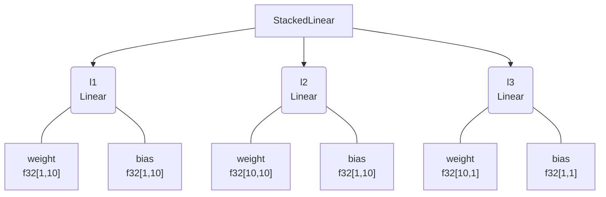

<h1 align="center" style="font-family:Monospace" >🌲Pytreeclass🌲</h1>
<h2 align="center">Write pytorch-like layers with rich visualizations in JAX.</h2>

[**Installation**](#Installation)
|[**Description**](#Description)
|[**Quick Example**](#QuickExample)
|[**StatefulComputation**](#StatefulComputation)
|[**More**](#More)
|[**Applications**](#Applications)
|[**Acknowledgements**](#Acknowledgements)


[](https://colab.research.google.com/drive/1bkYr-5HidtRSXFFBlvYqFa5pc5fQK_7-?usp=sharing)
[](https://pepy.tech/project/pytreeclass)
[](https://codecov.io/gh/ASEM000/pytreeclass)
[](https://pytreeclass.readthedocs.io/en/latest/?badge=latest)

<!-- [](https://pepy.tech/project/kernex) -->

## 🛠️ Installation<a id="Installation"></a>

```python
pip install pytreeclass
```

## 📖 Description<a id="Description"></a>

A JAX compatible `dataclass` like datastructure with the following functionalities

- Create PyTorch like NN classes 
- Provides rich visualizations for pytrees wrapped with `@pytc.treeclass`.
- Boolean indexing on Pytrees in functional style similar to jax.numpy. e.g. `x.at[x<0].set(0) `
- Apply math/numpy operations on pytrees 

## ⏩ Quick Example <a id="QuickExample">

### 🏗️ Create simple MLP

```python
import jax
from jax import numpy as jnp
import pytreeclass as pytc
import matplotlib.pyplot as plt

@pytc.treeclass
class Linear :
   # Any variable not wrapped with @pytc.treeclass
   # should be declared as a dataclass field here
   weight : jnp.ndarray
   bias   : jnp.ndarray

   def __init__(self,key,in_dim,out_dim):
       self.weight = jax.random.normal(key,shape=(in_dim, out_dim)) * jnp.sqrt(2/in_dim)
       self.bias = jnp.ones((1,out_dim))

   def __call__(self,x):
       return x @ self.weight + self.bias

@pytc.treeclass
class StackedLinear:

    def __init__(self,key,in_dim,out_dim,hidden_dim):
        keys= jax.random.split(key,3)

        # Declaring l1,l2,l3 as dataclass_fields is optional
        # as l1,l2,l3 are Linear class that is wrapped with @pytc.treeclass
        self.l1 = Linear(key=keys[0],in_dim=in_dim,out_dim=hidden_dim)
        self.l2 = Linear(key=keys[1],in_dim=hidden_dim,out_dim=hidden_dim)
        self.l3 = Linear(key=keys[2],in_dim=hidden_dim,out_dim=out_dim)

    def __call__(self,x):
        x = self.l1(x)
        x = jax.nn.tanh(x)
        x = self.l2(x)
        x = jax.nn.tanh(x)
        x = self.l3(x)

        return x
        
>>> model = StackedLinear(in_dim=1,out_dim=1,hidden_dim=10,key=jax.random.PRNGKey(0))

>>> x = jnp.linspace(0,1,100)[:,None]
>>> y = x**3 + jax.random.uniform(jax.random.PRNGKey(0),(100,1))*0.01
```

### 🎨 Visualize

<div align="center">
<table>
<tr>
 <td align = "center"> summary </td> <td align = "center">tree_box</td><td align = "center">tree_diagram</td>
</tr>
<tr>
 
<td>

```python


>>> print(model.summary())
┌──────┬───────┬───────┬─────────────────┐
│Type  │Param #│Size   │Config           │
├──────┼───────┼───────┼─────────────────┤
│Linear│20     │80.00B │weight=f32[1,10] │
│      │(0)    │(0.00B)│bias=f32[1,10]   │
├──────┼───────┼───────┼─────────────────┤
│Linear│110    │440.00B│weight=f32[10,10]│
│      │(0)    │(0.00B)│bias=f32[1,10]   │
├──────┼───────┼───────┼─────────────────┤
│Linear│11     │44.00B │weight=f32[10,1] │
│      │(0)    │(0.00B)│bias=f32[1,1]    │
└──────┴───────┴───────┴─────────────────┘
Total # :		141(0)
Dynamic #:		141(0)
Static/Frozen #:	0(0)
------------------------------------------
Total size :		564.00B(0.00B)
Dynamic size:		564.00B(0.00B)
Static/Frozen size:	0.00B(0.00B)
==========================================
```

</td>

 <td>
 
```python
>>> print(model.tree_box(array=x))
# using jax.eval_shape (no-flops operation)
# ** note ** : the created modules 
# in __init__ should be in the same order
# where they are called in __call__
┌─────────────────────────────────────┐
│StackedLinear(Parent)                │
├─────────────────────────────────────┤
│┌────────────┬────────┬─────────────┐│
││            │ Input  │ f32[100,1]  ││
││ Linear(l1) │────────┼─────────────┤│
││            │ Output │ f32[100,10] ││
│└────────────┴────────┴─────────────┘│
│┌────────────┬────────┬─────────────┐│
││            │ Input  │ f32[100,10] ││
││ Linear(l2) │────────┼─────────────┤│
││            │ Output │ f32[100,10] ││
│└────────────┴────────┴─────────────┘│
│┌────────────┬────────┬─────────────┐│
││            │ Input  │ f32[100,10] ││
││ Linear(l3) │────────┼─────────────┤│
││            │ Output │ f32[100,1]  ││
│└────────────┴────────┴─────────────┘│
└─────────────────────────────────────┘
```
</td>
 
<td>

```python
>>> print(model.tree_diagram())
StackedLinear
    ├── l1=Linear
    │   ├── weight=f32[1,10]
    │   └── bias=f32[1,10]
    ├── l2=Linear
    │   ├── weight=f32[10,10]
    │   └── bias=f32[1,10]
    └──l3=Linear
        ├── weight=f32[10,1]
        └── bias=f32[1,1]
```

 </td>

</tr>
 
<tr>
 
 </tr>
</table>

<table>
<tr><td align = "center" > mermaid.io (Native support in Github/Notion)</td></tr>
<tr>
 
<td>

```python
# generate mermaid diagrams
# print(pytc.tree_viz.tree_mermaid(model)) # generate core syntax
>>> pytc.tree_viz.save_viz(model,filename="test_mermaid",method="tree_mermaid_md")
# use `method="tree_mermaid_html"` to save as html
```


<div align="center",font-weight="bold">✨ Generate shareable vizualization links ✨</div>

```python
>>> pytc.tree_viz.tree_mermaid(model,link=True)
'Open URL in browser: https://pytreeclass.herokuapp.com/temp/?id=*********'
```


</td>

</tr>
 </table>

 </div>

### ✂️ Model surgery
```python
# freeze l1
>>> model.l1 = model.l1.freeze()

# set negative values in l2 to 0
>>> model.l2 = model.l2.at[model.l2<0].set(0)

# apply sin(x) to all values in l3
>>> model.l3 = model.l3.at[model.l3==model.l3].apply(jnp.sin)

# frozen nodes are marked with #
>>> print(model.tree_diagram())
StackedLinear
    ├── l1=Linear
    │   ├#─ weight=f32[1,10]
    │   └#─ bias=f32[1,10]  
    ├── l2=Linear
    │   ├── weight=f32[10,10]
    │   └── bias=f32[1,10]  
    └── l3=Linear
        ├── weight=f32[10,1]
        └── bias=f32[1,1] 
```

## 📜 Stateful computations<a id="StatefulComputation"></a>
[JAX reference](https://jax.readthedocs.io/en/latest/jax-101/07-state.html?highlight=state)

Under jax.jit jax requires states to be explicit, this means that for any class instance; variables needs to be separated from the class and be passed explictly. However when using @pytc.treeclass no need to separate the instance variables ; instead the whole instance is passed as a state.

The following code snippets compares between the two concepts by comparing MLP's implementation.
<table>
<tr>
<td>Explicit state </td>
<td>Class instance as state</td>
</tr>

<tr>

<td>

```python
import jax.numpy as jnp
import jax.random as jr
from jax.nn.initializers import he_normal
from jax.tree_util import tree_map
from jax import nn, value_and_grad

def init_params(layers):
  keys = jr.split(
      jr.PRNGKey(0),len(layers)-1
  )
    
  params = list()
  init_func = he_normal()
  for key,n_in,n_out in zip(
    keys,
    layers[:-1],
    layers[1:]
  ):
    
    W = init_func(key,(n_in,n_out))
    B = jr.uniform(key,shape=(n_out,))
    params.append({'W':W,'B':B})
  return params

def fwd(params,x):
  *hidden,last = params
  for layer in hidden :
    x = nn.tanh(x@layer['W']+layer['B'])
  return x@last['W'] + last['B']

def loss_func(params,x,y):
  pred = fwd(params,x)
  return jnp.mean((pred-y)**2)

@jax.jit
def update(params,x,y):
  # gradient w.r.t to params
  value,grads= value_and_grad(loss_func)(params,x,y)
  params =  jax.tree_map(
    lambda params,grads : params-1e-3*grads, params,grads
  )
  return value,params

x = jnp.linspace(0,1,100).reshape(100,1)
y = x**2 -1 

params = init_params([1] +[5]*4+[1] )

epochs = 10_000
for _ in range(1,epochs+1):
  value , params = update(params,x,y)

  # print loss and epoch info
  if _ %(1_000) ==0:
    print(f'Epoch={_}\tloss={value:.3e}')
 ```
</td>

<td>

```python
import jax.numpy as jnp
import jax.random as jr
from jax.nn.initializers import he_normal
from jax.tree_util import tree_map
from jax import nn, value_and_grad

@pytc.treeclass
class MLP:
  Layers : list

  def __init__(self,layers):
    keys = jax.random.split(
        jax.random.PRNGKey(0),len(layers)-1
      )
    self.Layers = list()
    init_func = he_normal()
    for key,n_in,n_out in zip(
      keys,
      layers[:-1],
      layers[1:]
     ):

      W = init_func(key,(n_in,n_out))
      B = jr.uniform(key,shape=(n_out,))
      self.Layers.append({'W':W,'B':B})

  def __call__(self,x):
    *hidden,last = self.Layers
    for layer in hidden :
      x = nn.tanh(x@layer['W']+layer['B'])
    return x@last['W'] + last['B']

def loss_func(model,x,y):
  pred = model(x)
  return jnp.mean((pred-y)**2)

@jax.jit
def update(model,x,y):
  # gradient w.r.t to model
  value , grads= value_and_grad(loss_func)(model,x,y)
  model = tree_map(
    lambda model,grads : model-1e-3*grads, model,grads
  )
  return value , model

x = jnp.linspace(0,1,100).reshape(100,1)
y = x**2 -1

model = MLP([1] +[5]*4+[1] )

epochs = 10_000
for _ in range(1,epochs+1):
  value , model = update(model,x,y)

  # print loss and epoch info
  if _ %(1_000) ==0:
    print(f'Epoch={_}\tloss={value:.3e}')
```
</td>

</tr>

</table>

## 🔢 More<a id="More"></a>

<details><summary>More compact boilerplate</summary>

```python
# more compact definition 
# with class definition at runtime call
@pytc.treeclass
class StackedLinear2:

    def __init__(self,key):
        self.keys = jax.random.split(key,3)

    def __call__(self,x):
        # The Linear layers are defined on the first call
        # and retrieved on the subsequent calls
        # this pattern is useful if module definition depends runtime data.
        
        in_dim = out_dim = x.shape[-1]
        k1,k2,k3 = self.keys

        x = self.register_node(Linear(k1,in_dim,10),name="l1")(x)
        x = jax.nn.tanh(x)
        x = self.register_node(Linear(k2,10,10),name="l2")(x)
        x = jax.nn.tanh(x)
        x = self.register_node(Linear(k3,10,out_dim),name="l3")(x)

        return x
```

</details>

<details>

<summary>Using out-of-place indexing on Pytrees</summary>


Similar to [JAX](https://jax.readthedocs.io/en/latest/_autosummary/jax.numpy.ndarray.at.html#jax.numpy.ndarray.at) pytreeclass provides `.at` property for out-of-place update.

```python
# get layer1
layer1 = model.l1
```

```python
# layer1 repr
>>> print(f"{layer1!r}")
Linear(
  weight=f32[1,10],
  bias=f32[1,10])
 ```
  
```python
# layer1 str
>>> print(f"{layer1!s}")
Linear(
  weight=
    [[-2.5491788   1.674097    0.07813213  0.47670904 -1.8760327  -0.9941608
       0.2808009   0.6522513  -0.53470623  1.0796958 ]],
  bias=
    [[1.0368661  0.98985153 1.0104426  0.9997676  1.2349331  0.9800282
      0.9618377  0.99291945 0.9431369  1.0172408 ]])
```

```python
# set negative values to 0
>>> print(layer1.at[layer1<0].set(0))
Linear(
  weight=
    [[0.         1.674097   0.07813213 0.47670904 0.         0.
      0.2808009  0.6522513  0.         1.0796958 ]],
  bias=
    [[1.0368661  0.98985153 1.0104426  0.9997676  1.2349331  0.9800282
      0.9618377  0.99291945 0.9431369  1.0172408 ]])
```

```python
# get only positive values
>>> print(layer1.at[layer1>0].get())
Linear(
  weight=
    [1.674097   0.07813213 0.47670904 0.2808009  0.6522513  1.0796958 ],
  bias=
    [1.0368661  0.98985153 1.0104426  0.9997676  1.2349331  0.9800282
     0.9618377  0.99291945 0.9431369  1.0172408 ])
```

</details>

<details>
<summary>Perform Math operations on Pytrees</summary>

```python
@pytc.treeclass
class Test :
    a : float
    b : float
    c : float
    name : str 
```
```python
# basic operations
>>> A = Test(10,20,30,'A')
>>> (A + A)                 # Test(20,40,60,'A')
>>> (A - A)                 # Test(0,0,0,'A')
>>> (A*A).reduce_mean()     # 1400
>>> (A + 1)                 # Test(11,21,31,'A')
```
```python
# only add 1 to field `a`
# all other fields are set to None and returns the same class
>>> assert (A['a'] + 1) == Test(11,None,None,'A')

# use `|` to merge classes by performing ( left_node or  right_node )
>>> Aa = A['a'] + 10 # Test(a=20,b=None,c=None,name=A)
>>> Ab = A['b'] + 10 # Test(a=None,b=30,c=None,name=A)

>>> assert (Aa | Ab | A ) == Test(20,30,30,'A')

# indexing by class
>>> A[A>10]  # Test(a=None,b=20,c=30,name='A')
```
```python
# Register custom operations
>>> B = Test([10,10],20,30,'B')
>>> B.register_op( func=lambda node:node+1,name='plus_one')
>>> B.plus_one()  # Test(a=[11, 11],b=21,c=31,name='B')


# Register custom reduce operations ( similar to functools.reduce)
>>> C = Test(jnp.array([10,10]),20,30,'C')

>>> C.register_op(
        func=jnp.prod,            # function applied on each node
        name='product',           # name of the function
        reduce_op=lambda x,y:x*y, # function applied between nodes (accumulated * current node)
        init_val=1                # initializer for the reduce function
                )

# product applies only on each node
# and returns an instance of the same class
>>> C.product() # Test(a=100,b=20,c=30,name='C')

# `reduce_` + name of the registered function (`product`)
# reduces the class and returns a value
>>> C.reduce_product() # 60000
```

</details>


## 📝 Applications<a id="Applications"></a>

| Description |
|---|
| [Physics informed neural network (PINN)](https://github.com/ASEM000/Physics-informed-neural-network-in-JAX)  |


## 📙 Acknowledgements<a id="Acknowledgements"></a>

- [Equinox](https://github.com/patrick-kidger/equinox)
- [Treex](https://github.com/cgarciae/treex)
- [tree-math](https://github.com/google/tree-math)
