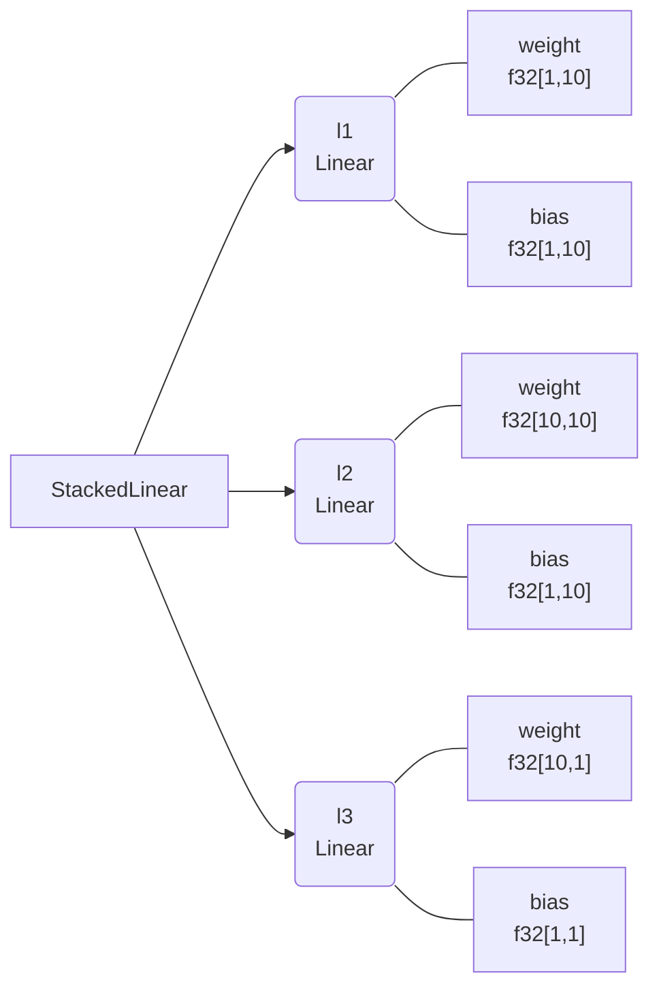

<!-- <h1 align="center" style="font-family:Monospace" >Py🌲Class</h1> -->
<div align="center">
</div>
<h2 align="center">Write pytorch-like layers with rich visualizations in JAX.</h2>

[**Installation**](#Installation)
|[**Description**](#Description)
|[**Quick Example**](#QuickExample)
|[**StatefulComputation**](#StatefulComputation)
|[**More**](#More)
|[**Applications**](#Applications)
|[**Acknowledgements**](#Acknowledgements)


[](https://colab.research.google.com/drive/1bkYr-5HidtRSXFFBlvYqFa5pc5fQK_7-?usp=sharing)
[](https://pepy.tech/project/pytreeclass)
[](https://codecov.io/gh/ASEM000/pytreeclass)
[](https://pytreeclass.readthedocs.io/en/latest/?badge=latest)

<!-- [](https://pepy.tech/project/kernex) -->

## 🛠️ Installation<a id="Installation"></a>

```python
pip install pytreeclass
```

## 📖 Description<a id="Description"></a>

PyTreeClass offers a JAX compatible `dataclass` like datastructure with the following functionalities

- 🏗️ [Create PyTorch like NN classes](#Pytorch)
- 🎨 [Visualize for pytrees decorated with `@pytc.treeclass`.](#Viz)
- ☝️ [Filtering/Indexing on Pytrees in functional style similar to `jax.numpy.at` ](#Filtering)


## ⏩ Quick Example <a id="QuickExample">

### 🏗️ Create simple MLP <a id="Pytorch">

_For Autoencoder example from scratch see_ [here](#AE)

```python
import jax
from jax import numpy as jnp
import pytreeclass as pytc
import matplotlib.pyplot as plt

@pytc.treeclass
class Linear :
   # Any variable not wrapped with @pytc.treeclass
   # should be declared as a dataclass field here
   weight : jnp.ndarray
   bias   : jnp.ndarray

   def __init__(self,key,in_dim,out_dim):
       self.weight = jax.random.normal(key,shape=(in_dim, out_dim)) * jnp.sqrt(2/in_dim)
       self.bias = jnp.ones((1,out_dim))

   def __call__(self,x):
       return x @ self.weight + self.bias

@pytc.treeclass
class StackedLinear:

    def __init__(self,key,in_dim,out_dim,hidden_dim):
        keys= jax.random.split(key,3)

        # Declaring l1,l2,l3 as dataclass_fields is optional
        # as l1,l2,l3 are Linear class that is wrapped with @pytc.treeclass
        # To strictly include nodes defined in dataclass fields 
        # use `@pytc.treeclass(field_only=True)`
        self.l1 = Linear(key=keys[0],in_dim=in_dim,out_dim=hidden_dim)
        self.l2 = Linear(key=keys[1],in_dim=hidden_dim,out_dim=hidden_dim)
        self.l3 = Linear(key=keys[2],in_dim=hidden_dim,out_dim=out_dim)

    def __call__(self,x):
        x = self.l1(x)
        x = jax.nn.tanh(x)
        x = self.l2(x)
        x = jax.nn.tanh(x)
        x = self.l3(x)

        return x
        
>>> model = StackedLinear(in_dim=1,out_dim=1,hidden_dim=10,key=jax.random.PRNGKey(0))

>>> x = jnp.linspace(0,1,100)[:,None]
>>> y = x**3 + jax.random.uniform(jax.random.PRNGKey(0),(100,1))*0.01
```

### 🎨 Visualize<a id="Viz">

<div align="center">
<table>
<tr>
 <td align = "center"> summary </td> <td align = "center">tree_box</td><td align = "center">tree_diagram</td>
</tr>
<tr>
 
<td>

```python


>>> print(model.summary())
┌──────┬───────┬───────┬─────────────────┐
│Type  │Param #│Size   │Config           │
├──────┼───────┼───────┼─────────────────┤
│Linear│20     │80.00B │weight=f32[1,10] │
│      │(0)    │(0.00B)│bias=f32[1,10]   │
├──────┼───────┼───────┼─────────────────┤
│Linear│110    │440.00B│weight=f32[10,10]│
│      │(0)    │(0.00B)│bias=f32[1,10]   │
├──────┼───────┼───────┼─────────────────┤
│Linear│11     │44.00B │weight=f32[10,1] │
│      │(0)    │(0.00B)│bias=f32[1,1]    │
└──────┴───────┴───────┴─────────────────┘
Total # :		141(0)
Dynamic #:		141(0)
Static/Frozen #:	0(0)
------------------------------------------
Total size :		564.00B(0.00B)
Dynamic size:		564.00B(0.00B)
Static/Frozen size:	0.00B(0.00B)
==========================================
```

</td>

 <td>
 
```python
>>> print(model.tree_box(array=x))
# using jax.eval_shape (no-flops operation)
# ** note ** : the created modules 
# in __init__ should be in the same order
# where they are called in __call__
┌─────────────────────────────────────┐
│StackedLinear(Parent)                │
├─────────────────────────────────────┤
│┌────────────┬────────┬─────────────┐│
││            │ Input  │ f32[100,1]  ││
││ Linear(l1) │────────┼─────────────┤│
││            │ Output │ f32[100,10] ││
│└────────────┴────────┴─────────────┘│
│┌────────────┬────────┬─────────────┐│
││            │ Input  │ f32[100,10] ││
││ Linear(l2) │────────┼─────────────┤│
││            │ Output │ f32[100,10] ││
│└────────────┴────────┴─────────────┘│
│┌────────────┬────────┬─────────────┐│
││            │ Input  │ f32[100,10] ││
││ Linear(l3) │────────┼─────────────┤│
││            │ Output │ f32[100,1]  ││
│└────────────┴────────┴─────────────┘│
└─────────────────────────────────────┘
```
</td>
 
<td>

```python
>>> print(model.tree_diagram())
StackedLinear
    ├── l1=Linear
    │   ├── weight=f32[1,10]
    │   └── bias=f32[1,10]
    ├── l2=Linear
    │   ├── weight=f32[10,10]
    │   └── bias=f32[1,10]
    └──l3=Linear
        ├── weight=f32[10,1]
        └── bias=f32[1,1]
```

 </td>

</tr>
 
<tr>
 
 </tr>
</table>

<table>
<tr><td align = "center" > mermaid.io (Native support in Github/Notion)</td></tr>
<tr>
 
<td>

```python
# generate mermaid diagrams
# print(pytc.tree_viz.tree_mermaid(model)) # generate core syntax
>>> pytc.tree_viz.save_viz(model,filename="test_mermaid",method="tree_mermaid_md")
# use `method="tree_mermaid_html"` to save as html
```


<div align="center",font-weight="bold">✨ Generate shareable vizualization links ✨</div>

```python
>>> pytc.tree_viz.tree_mermaid(model,link=True)
'Open URL in browser: https://pytreeclass.herokuapp.com/temp/?id=*********'
```


</td>

</tr>
 </table>

 </div>

### ✂️ Model surgery
```python
# freeze l1
>>> model.l1 = model.l1.freeze()

# set negative values in l2 to 0
>>> model.l2 = model.l2.at[model.l2<0].set(0)

# apply sin(x) to all values in l3
>>> model.l3 = model.l3.at[...].apply(jnp.sin)

# frozen nodes are marked with #
>>> print(model.tree_diagram())
StackedLinear
    ├── l1=Linear
    │   ├#─ weight=f32[1,10]
    │   └#─ bias=f32[1,10]  
    ├── l2=Linear
    │   ├── weight=f32[10,10]
    │   └── bias=f32[1,10]  
    └── l3=Linear
        ├── weight=f32[10,1]
        └── bias=f32[1,1] 
```

## 📜 Stateful computations<a id="StatefulComputation"></a>
[JAX reference](https://jax.readthedocs.io/en/latest/jax-101/07-state.html?highlight=state)

Under jax.jit jax requires states to be explicit, this means that for any class instance; variables needs to be separated from the class and be passed explictly. However when using @pytc.treeclass no need to separate the instance variables ; instead the whole instance is passed as a state.

Using the following pattern,Updating state can be achieved under `jax.jit`

```python
@pytc.treeclass
class Counter:
    calls : int = 0
    
    def increment(self):
        self.calls += 1 
        

>>> c = Counter()

@jax.jit
def update(c):
    c.increment()
    return c 

for i in range(10):
    c = update(c)

>>> print(c.calls)
10
```


The following code snippets compares between the two concepts by comparing MLP's implementation.
<details>
<div align="center">
<table>
<tr>
<td>Explicit state </td>
<td>Class instance as state</td>
</tr>

<tr>

<td>

```python
import jax.numpy as jnp
import jax.random as jr
from jax.nn.initializers import he_normal
from jax.tree_util import tree_map
from jax import nn, value_and_grad,jit
import pytreeclass as pytc 

def init_params(layers):
  keys = jr.split(
      jr.PRNGKey(0),len(layers)-1
  )
    
  params = list()
  init_func = he_normal()
  for key,n_in,n_out in zip(
    keys,
    layers[:-1],
    layers[1:]
  ):
    
    W = init_func(key,(n_in,n_out))
    B = jr.uniform(key,shape=(n_out,))
    params.append({'W':W,'B':B})
  return params

def fwd(params,x):
  *hidden,last = params
  for layer in hidden :
    x = nn.tanh(x@layer['W']+layer['B'])
  return x@last['W'] + last['B']


@value_and_grad
def loss_func(params,x,y):
  pred = fwd(params,x)
  return jnp.mean((pred-y)**2)

@jit
def update(params,x,y):
  # gradient w.r.t to params
  value,grads= loss_func(params,x,y)
  params =  tree_map(
    lambda x,y : x-1e-3*y, params,grads
  )
  return value,params

x = jnp.linspace(0,1,100).reshape(100,1)
y = x**2 -1 

params = init_params([1] +[5]*4+[1] )

epochs = 10_000
for _ in range(1,epochs+1):
  value , params = update(params,x,y)

  # print loss and epoch info
  if _ %(1_000) ==0:
    print(f'Epoch={_}\tloss={value:.3e}')
 ```
</td>

<td>

```python
import jax.numpy as jnp
import jax.random as jr
from jax.nn.initializers import he_normal
from jax.tree_util import tree_map
from jax import nn, value_and_grad,jit
import pytreeclass as pytc 

@pytc.treeclass
class MLP:
  Layers : list

  def __init__(self,layers):
    keys = jr.split(
        jr.PRNGKey(0),len(layers)-1
      )
    self.Layers = list()
    init_func = he_normal()
    for key,n_in,n_out in zip(
      keys,
      layers[:-1],
      layers[1:]
     ):

      W = init_func(key,(n_in,n_out))
      B = jr.uniform(key,shape=(n_out,))
      self.Layers.append({'W':W,'B':B})

  def __call__(self,x):
    *hidden,last = self.Layers
    for layer in hidden :
      x = nn.tanh(x@layer['W']+layer['B'])
    return x@last['W'] + last['B']

@value_and_grad
def loss_func(model,x,y):
  pred = model(x)
  return jnp.mean((pred-y)**2)

@jit
def update(model,x,y):
  # gradient w.r.t to model
  value , grads= loss_func(model,x,y)
  model = tree_map(
    lambda x,y : x-1e-3*y, model,grads
  )
  return value , model

x = jnp.linspace(0,1,100).reshape(100,1)
y = x**2 -1

model = MLP([1] +[5]*4+[1] )

epochs = 10_000
for _ in range(1,epochs+1):
  value , model = update(model,x,y)

  # print loss and epoch info
  if _ %(1_000) ==0:
    print(f'Epoch={_}\tloss={value:.3e}')
```
</td>

</tr>

</table>
</div>
</details>

## 🔢 More<a id="More"></a>

<details><summary><mark>More compact boilerplate</mark></summary>

Standard definition of nodes in `__init__` and calling in `__call__`
```python
@pytc.treeclass
class StackedLinear:
    def __init__(self,key,in_dim,out_dim,hidden_dim):
        keys= jax.random.split(key,3)
        self.l1 = Linear(key=keys[0],in_dim=in_dim,out_dim=hidden_dim)
        self.l2 = Linear(key=keys[1],in_dim=hidden_dim,out_dim=hidden_dim)
        self.l3 = Linear(key=keys[2],in_dim=hidden_dim,out_dim=out_dim)

    def __call__(self,x):
        x = self.l1(x)
        x = jax.nn.tanh(x)
        x = self.l2(x)
        x = jax.nn.tanh(x)
        x = self.l3(x)
        return x
```
Using `register_node`:
- More compact definition with node definition at runtime call
- The Linear layers are defined on the first call and retrieved on the subsequent calls
- This pattern is useful if module definition depends runtime data.
```python
@pytc.treeclass
class StackedLinear:
    def __init__(self,key):
        self.keys = jax.random.split(key,3)

    def __call__(self,x):
        x = self.register_node(Linear(self.keys[0],x.shape[-1],10),name="l1")(x)
        x = jax.nn.tanh(x)
        x = self.register_node(Linear(self.keys[1],10,10),name="l2")(x)
        x = jax.nn.tanh(x)
        x = self.register_node(Linear(self.keys[2],10,x.shape[-1]),name="l3")(x)
        return x
```

</details>

### ☝️ Filtering with `.at[]` <a id="Filtering">
`PyTreeClass` offers four means of filtering: 
1. Filter by value
2. Filter by field name
3. Filter by field type
4. Filter by field metadata.

The following example demonstrates the usage the filtering.
Suppose you have the following (Multilayer perceptron) MLP class  
- **note in `StackedLinear` we added a description to `l1` and `l2` through the metadata in the `field`**

```python
import jax
from jax import numpy as jnp
import pytreeclass as pytc
import matplotlib.pyplot as plt
from dataclasses import  field 

@pytc.treeclass
class Linear :
   weight : jnp.ndarray
   bias   : jnp.ndarray

   def __init__(self,key,in_dim,out_dim):
       self.weight = jax.random.normal(key,shape=(in_dim, out_dim)) * jnp.sqrt(2/in_dim)
       self.bias = jnp.ones((1,out_dim))

   def __call__(self,x):
       return x @ self.weight + self.bias

@pytc.treeclass
class StackedLinear:
    l1 : Linear = field(metadata={"description": "First layer"})
    l2 : Linear = field(metadata={"description": "Second layer"})

    def __init__(self,key,in_dim,out_dim,hidden_dim):
        keys= jax.random.split(key,3)

        self.l1 = Linear(key=keys[0],in_dim=in_dim,out_dim=hidden_dim)
        self.l2 = Linear(key=keys[2],in_dim=hidden_dim,out_dim=out_dim)

    def __call__(self,x):
        x = self.l1(x)
        x = jax.nn.tanh(x)
        x = self.l2(x)

        return x
        
model = StackedLinear(in_dim=1,out_dim=1,hidden_dim=5,key=jax.random.PRNGKey(0))
```

* Raw model values before any filtering.
```python
>>> print(model)

StackedLinear(
  l1=Linear(
    weight=[[-1.6248673  -2.8383057   1.3969219   1.3169124  -0.40784812]],
    bias=[[1. 1. 1. 1. 1.]]),
  l2=Linear(
    weight=
      [[ 0.98507565]
       [ 0.99815285]
       [-1.0687716 ]
       [-0.19255024]
       [-1.2108876 ]],
    bias=[[1.]]))
```

#### Filter by value

* Get all negative values
```python
>>> print(model.at[model<0].get())
StackedLinear(
  l1=Linear(
    weight=[-1.6248673  -2.8383057  -0.40784812],
    bias=[]),
  l2=Linear(
    weight=[-1.0687716  -0.19255024 -1.2108876 ],
    bias=[]))
```

*  Set negative values to 0
```python
>>> print(model.at[model<0].set(0))
StackedLinear(
  l1=Linear(
    weight=[[0.        0.        1.3969219 1.3169124 0.       ]],
    bias=[[1. 1. 1. 1. 1.]]),
  l2=Linear(
    weight=
      [[0.98507565]
       [0.99815285]
       [0.        ]
       [0.        ]
       [0.        ]],
    bias=[[1.]]))
```

* Apply f(x)=x^2 to negative values
```python
>>> print(model.at[model<0].apply(lambda x:x**2))
StackedLinear(
  l1=Linear(
    weight=[[2.6401937  8.05598    1.3969219  1.3169124  0.16634008]],
    bias=[[1. 1. 1. 1. 1.]]),
  l2=Linear(
    weight=
      [[0.98507565]
       [0.99815285]
       [1.1422727 ]
       [0.03707559]
       [1.4662486 ]],
    bias=[[1.]]))
```
* Sum all negative values
```python
>>> print(model.at[model<0].reduce_sum())
-7.3432307
```

#### Filter by field name

* Get all fields named `l1`
```python
>>> print(model.at[model == "l1"].get())
StackedLinear(
  l1=Linear(
    weight=[-1.6248673  -2.8383057   1.3969219   1.3169124  -0.40784812],
    bias=[1. 1. 1. 1. 1.]),
  l2=Linear(weight=[],bias=[]))
```

#### Filter by field type
* Get all fields of `Linear` type
```python
>>> print(model.at[model == Linear].get())
StackedLinear(
  l1=Linear(
    weight=[-1.6248673  -2.8383057   1.3969219   1.3169124  -0.40784812],
    bias=[1. 1. 1. 1. 1.]),
  l2=Linear(
    weight=[ 0.98507565  0.99815285 -1.0687716  -0.19255024 -1.2108876 ],
    bias=[1.]))
```

#### Filter by field metadata
* Get all fields of with `{"description": "First layer"}` in their metadata
```python
>>> print(model.at[model == {"description": "First layer"}].get())
StackedLinear(
  l1=Linear(
    weight=[-1.6248673  -2.8383057   1.3969219   1.3169124  -0.40784812],
    bias=[1. 1. 1. 1. 1.]),
  l2=Linear(weight=[],bias=[]))
```

## 📝 Applications<a id="Applications"></a>
- [Physics informed neural network (PINN)](https://github.com/ASEM000/Physics-informed-neural-network-in-JAX) 


<details id="AE" ><summary>Simple AutoEncoder from scratch</summary>

While `jax.lax` can be used to construct Convolution, Upsample, Maxpooling functions, in this example [kernex](https://github.com/ASEM000/kernex) is used for its clear syntax.

<details><summary>AE Construction</summary>

```python

from typing import Sequence

import jax
import jax.numpy as jnp
import jax.random as jr
import pytreeclass as pytc  # dataclass-like decorator for JAX

import kernex as kex # for stencil computations


@pytc.treeclass
class Conv2D:

    weight: jnp.ndarray
    bias: jnp.ndarray

    # define these variabels here
    # to be used in __call__
    in_channels: int = pytc.static_field()
    out_channels: int = pytc.static_field()
    kernel_size: Sequence[int] = pytc.static_field()
    padding: Sequence[str] = pytc.static_field()
    strides: Sequence[int] = pytc.static_field()

    def __init__(
        self,
        in_channels,
        out_channels,
        kernel_size,
        strides=1,
        padding=("same", "same"),
        key=jax.random.PRNGKey(0),
        kernel_initializer=jax.nn.initializers.kaiming_uniform(),
    ):

        self.weight = kernel_initializer(key, (out_channels, in_channels, *kernel_size))
        self.bias = jnp.zeros((out_channels, *((1,) * len(kernel_size))))

        self.in_channels = in_channels
        self.out_channels = out_channels
        self.kernel_size = kernel_size
        self.strides = strides
        self.padding = ("valid",) + padding

    def __call__(self, x):
        @kex.kmap(
            kernel_size=(self.in_channels, *self.kernel_size),
            strides=self.strides,
            padding=self.padding,
        )
        def _conv2d(x, w):
            return jnp.sum(x * w)

        @jax.vmap  # vectorize on batch dimension
        def fwd_image(image):
            # filters shape is OIHW
            # vectorize on filters output dimension
            return jax.vmap(lambda w: _conv2d(image, w))(self.weight)[:, 0] + (
                self.bias if self.bias is not None else 0
            )

        return fwd_image(x)


@pytc.treeclass
class Upsample2D:
    scale_factor: int = pytc.static_field()

    def __call__(self, x):

        batch, channel, row, col = x.shape

        @kex.kmap(
            kernel_size=(channel, row, col),
            strides=(1, 1, 1),
            padding="valid",
            relative=False,
        )
        def __upsample2D(x):
            return x.repeat(self.scale_factor, axis=2).repeat(self.scale_factor, axis=1)

        def _upsample2D(batch):
            return jnp.squeeze(
                jax.vmap(__upsample2D, in_axes=(0,))(batch), axis=tuple(range(1, 4))
            )

        return _upsample2D(x)


@pytc.treeclass
class MaxPool2D:

    kernel_size: tuple[int, int] = pytc.static_field(default=(2, 2))
    strides: int = pytc.static_field(default=2)
    padding: str | int = pytc.static_field(default="valid")

    def __call__(self, x):
        @jax.vmap  # apply on batch dimension
        @jax.vmap  # apply on channels dimension
        @kex.kmap(
            kernel_size=self.kernel_size, strides=self.strides, padding=self.padding
        )
        def _maxpool2d(x):
            return jnp.max(x)

        return _maxpool2d(x)


@pytc.treeclass
class AutoEncoder:
    def __init__(self, in_channels, out_channels, key):
        keys = jr.split(key, 5)

        self.l1 = MaxPool2D()
        self.l2 = Conv2D(in_channels, 16, (3, 3), key=keys[0])

        self.l3 = MaxPool2D()
        self.l4 = Conv2D(16, 32, (3, 3), key=keys[1])

        self.l5 = Upsample2D(scale_factor=2)
        self.l6 = Conv2D(32, 16, (3, 3), key=keys[2])
        
        self.l7 = Upsample2D(scale_factor=2)
        self.l8 = Conv2D(16, 1, (3, 3), key=keys[3])

        self.l9 = Conv2D(1, out_channels, (1, 1), key=keys[4])

    def __call__(self, x):
        x = self.l1(x)
        x = self.l2(x)
        x = jax.nn.relu(x)

        x = self.l3(x)
        x = self.l4(x)
        x = jax.nn.relu(x)

        x = self.l5(x)
        x = self.l6(x)
        x = jax.nn.relu(x)

        x = self.l7(x)
        x = self.l8(x)
        x = jax.nn.relu(x)

        x = self.l9(x)

        return x


ae = AutoEncoder(1, 1, jax.random.PRNGKey(0))
```
</details>


<details><summary>
Model summary
</summary>


```python
┌──────────┬───────┬───────┬─────────────────────┐
│Type      │Param #│Size   │Config               │
├──────────┼───────┼───────┼─────────────────────┤
│MaxPool2D │0      │0.00B  │                     │
│          │(0)    │(0.00B)│                     │
├──────────┼───────┼───────┼─────────────────────┤
│Conv2D    │160    │640.00B│weight=f32[16,1,3,3] │
│          │(0)    │(0.00B)│bias=f32[16,1,1]     │
├──────────┼───────┼───────┼─────────────────────┤
│MaxPool2D │0      │0.00B  │                     │
│          │(0)    │(0.00B)│                     │
├──────────┼───────┼───────┼─────────────────────┤
│Conv2D    │4,640  │18.12KB│weight=f32[32,16,3,3]│
│          │(0)    │(0.00B)│bias=f32[32,1,1]     │
├──────────┼───────┼───────┼─────────────────────┤
│Upsample2D│0      │0.00B  │                     │
│          │(0)    │(0.00B)│                     │
├──────────┼───────┼───────┼─────────────────────┤
│Conv2D    │4,624  │18.06KB│weight=f32[16,32,3,3]│
│          │(0)    │(0.00B)│bias=f32[16,1,1]     │
├──────────┼───────┼───────┼─────────────────────┤
│Upsample2D│0      │0.00B  │                     │
│          │(0)    │(0.00B)│                     │
├──────────┼───────┼───────┼─────────────────────┤
│Conv2D    │145    │580.00B│weight=f32[1,16,3,3] │
│          │(0)    │(0.00B)│bias=f32[1,1,1]      │
├──────────┼───────┼───────┼─────────────────────┤
│Conv2D    │2      │8.00B  │weight=f32[1,1,1,1]  │
│          │(0)    │(0.00B)│bias=f32[1,1,1]      │
└──────────┴───────┴───────┴─────────────────────┘
Total # :		9,571(0)
Dynamic #:		9,571(0)
Static/Frozen #:	0(0)
--------------------------------------------------
Total size :		37.39KB(0.00B)
Dynamic size:		37.39KB(0.00B)
Static/Frozen size:	0.00B(0.00B)
==================================================
```
</details>

<details>

<summary>Model diagram</summary>

**Note** : static_field(untrainable) is marked with `x`
```python
AutoEncoder
    ├── l1=MaxPool2D
    │   ├x─ kernel_size=(2, 2)
    │   ├x─ strides=2
    │   └x─ padding='valid' 
    ├── l2=Conv2D
    │   ├── weight=f32[16,1,3,3]
    │   ├── bias=f32[16,1,1]
    │   ├x─ in_channels=1
    │   ├x─ out_channels=16
    │   ├x─ kernel_size=(3, 3)
    │   ├x─ padding=('valid', 'same', 'same')
    │   └x─ strides=1   
    ├── l3=MaxPool2D
    │   ├x─ kernel_size=(2, 2)
    │   ├x─ strides=2
    │   └x─ padding='valid' 
    ├── l4=Conv2D
    │   ├── weight=f32[32,16,3,3]
    │   ├── bias=f32[32,1,1]
    │   ├x─ in_channels=16
    │   ├x─ out_channels=32
    │   ├x─ kernel_size=(3, 3)
    │   ├x─ padding=('valid', 'same', 'same')
    │   └x─ strides=1   
    ├── l5=Upsample2D
    │   └x─ scale_factor=2  
    ├── l6=Conv2D
    │   ├── weight=f32[16,32,3,3]
    │   ├── bias=f32[16,1,1]
    │   ├x─ in_channels=32
    │   ├x─ out_channels=16
    │   ├x─ kernel_size=(3, 3)
    │   ├x─ padding=('valid', 'same', 'same')
    │   └x─ strides=1   
    ├── l7=Upsample2D
    │   └x─ scale_factor=2  
    ├── l8=Conv2D
    │   ├── weight=f32[1,16,3,3]
    │   ├── bias=f32[1,1,1]
    │   ├x─ in_channels=16
    │   ├x─ out_channels=1
    │   ├x─ kernel_size=(3, 3)
    │   ├x─ padding=('valid', 'same', 'same')
    │   └x─ strides=1   
    └── l9=Conv2D
        ├── weight=f32[1,1,1,1]
        ├── bias=f32[1,1,1]
        ├x─ in_channels=1
        ├x─ out_channels=1
        ├x─ kernel_size=(1, 1)
        ├x─ padding=('valid', 'same', 'same')
        └x─ strides=1                               
```
</details>

<details>
<summary>
Shape propagration
</summary>

```python
>>> x = jnp.ones([1, 1, 100, 100])
>>> print(ae.tree_box(array=x))
┌───────────────────────────────────────────────┐
│AutoEncoder(Parent)                            │
├───────────────────────────────────────────────┤
│┌───────────────┬────────┬──────────────────┐  │
││               │ Input  │ f32[1,1,100,100] │  │
││ MaxPool2D(l1) │────────┼──────────────────┤  │
││               │ Output │ f32[1,1,50,50]   │  │
│└───────────────┴────────┴──────────────────┘  │
│┌────────────┬────────┬─────────────────┐      │
││            │ Input  │ f32[1,1,50,50]  │      │
││ Conv2D(l2) │────────┼─────────────────┤      │
││            │ Output │ f32[1,16,50,50] │      │
│└────────────┴────────┴─────────────────┘      │
│┌───────────────┬────────┬─────────────────┐   │
││               │ Input  │ f32[1,16,50,50] │   │
││ MaxPool2D(l3) │────────┼─────────────────┤   │
││               │ Output │ f32[1,16,25,25] │   │
│└───────────────┴────────┴─────────────────┘   │
│┌────────────┬────────┬─────────────────┐      │
││            │ Input  │ f32[1,16,25,25] │      │
││ Conv2D(l4) │────────┼─────────────────┤      │
││            │ Output │ f32[1,32,25,25] │      │
│└────────────┴────────┴─────────────────┘      │
│┌────────────────┬────────┬─────────────────┐  │
││                │ Input  │ f32[1,32,25,25] │  │
││ Upsample2D(l5) │────────┼─────────────────┤  │
││                │ Output │ f32[1,32,50,50] │  │
│└────────────────┴────────┴─────────────────┘  │
│┌────────────┬────────┬─────────────────┐      │
││            │ Input  │ f32[1,32,50,50] │      │
││ Conv2D(l6) │────────┼─────────────────┤      │
││            │ Output │ f32[1,16,50,50] │      │
│└────────────┴────────┴─────────────────┘      │
│┌────────────────┬────────┬───────────────────┐│
││                │ Input  │ f32[1,16,50,50]   ││
││ Upsample2D(l7) │────────┼───────────────────┤│
││                │ Output │ f32[1,16,100,100] ││
│└────────────────┴────────┴───────────────────┘│
│┌────────────┬────────┬───────────────────┐    │
││            │ Input  │ f32[1,16,100,100] │    │
││ Conv2D(l8) │────────┼───────────────────┤    │
││            │ Output │ f32[1,1,100,100]  │    │
│└────────────┴────────┴───────────────────┘    │
│┌────────────┬────────┬──────────────────┐     │
││            │ Input  │ f32[1,1,100,100] │     │
││ Conv2D(l9) │────────┼──────────────────┤     │
││            │ Output │ f32[1,1,100,100] │     │
│└────────────┴────────┴──────────────────┘     │
└───────────────────────────────────────────────┘
```
</details>

<details><summary>Mermaid diagram</summary>


</details>


</details>

## 📙 Acknowledgements<a id="Acknowledgements"></a>

```mermaid

flowchart LR
    id15696277213149321320[AutoEncoder]
    id15696277213149321320 --> id159132120600507116(l1\nMaxPool2D)
    id159132120600507116 --x id7500441386962467209["kernel_size\n(2, 2)"]
    id159132120600507116 --x id10793958738030044218["strides\n2"]
    id159132120600507116 --x id16245750007010064142["padding\n'valid'"]
    id15696277213149321320 --> id10009280772564895168(l2\nConv2D)
    id10009280772564895168 --- id11951215191344350637["weight\nf32[16,1,3,3]"]
    id10009280772564895168 --- id1196345851686744158["bias\nf32[16,1,1]"]
    id10009280772564895168 --x id6648137120666764082["in_channels\n1"]
    id10009280772564895168 --x id8609436656910886517["out_channels\n16"]
    id10009280772564895168 --x id14061227925890906441["kernel_size\n(3, 3)"]
    id10009280772564895168 --x id16022527462135028876["padding\n('valid', 'same', 'same')"]
    id10009280772564895168 --x id869300739493054269["strides\n1"]
    id15696277213149321320 --> id7572222925824649475(l3\nMaxPool2D)
    id7572222925824649475 --x id4749243995442935477["kernel_size\n(2, 2)"]
    id7572222925824649475 --x id8042761346510512486["strides\n2"]
    id7572222925824649475 --x id17892909998474900538["padding\n'valid'"]
    id15696277213149321320 --> id10865740276892226484(l4\nConv2D)
    id10865740276892226484 --- id7858522665561710831["weight\nf32[32,16,3,3]"]
    id10865740276892226484 --- id11152040016629287840["bias\nf32[32,1,1]"]
    id10865740276892226484 --x id2555444594884124276["in_channels\n16"]
    id10865740276892226484 --x id118386748143878583["out_channels\n32"]
    id10865740276892226484 --x id9968535400108266635["kernel_size\n(3, 3)"]
    id10865740276892226484 --x id7531477553368020942["padding\n('valid', 'same', 'same')"]
    id10865740276892226484 --x id10824994904435597951["strides\n1"]
    id15696277213149321320 --> id2269144855147062920(l5\nUpsample2D)
    id2269144855147062920 --x id599357636669938791["scale_factor\n2"]
    id15696277213149321320 --> id18278831082116368843(l6\nConv2D)
    id18278831082116368843 --- id5107325274042179099["weight\nf32[16,32,3,3]"]
    id18278831082116368843 --- id8400842625109756108["bias\nf32[16,1,1]"]
    id18278831082116368843 --x id18250991277074144160["in_channels\n32"]
    id18278831082116368843 --x id1765546739608714979["out_channels\n16"]
    id18278831082116368843 --x id7217338008588734903["kernel_size\n(3, 3)"]
    id18278831082116368843 --x id9178637544832857338["padding\n('valid', 'same', 'same')"]
    id18278831082116368843 --x id12472154895900434347["strides\n1"]
    id15696277213149321320 --> id9682235660371205279(l7\nUpsample2D)
    id9682235660371205279 --x id13157878626227910245["scale_factor\n2"]
    id15696277213149321320 --> id12975753011438782288(l8\nConv2D)
    id12975753011438782288 --- id16267157296346685599["weight\nf32[1,16,3,3]"]
    id12975753011438782288 --- id1113930573704710992["bias\nf32[1,1,1]"]
    id12975753011438782288 --x id10964079225669099044["in_channels\n16"]
    id12975753011438782288 --x id12925378761913221479["out_channels\n1"]
    id12975753011438782288 --x id11331140742258384578["kernel_size\n(3, 3)"]
    id12975753011438782288 --x id1891725493427812222["padding\n('valid', 'same', 'same')"]
    id12975753011438782288 --x id5185242844495389231["strides\n1"]
    id15696277213149321320 --> id10538695164698536595(l9\nConv2D)
    id10538695164698536595 --- id9065186100445270439["weight\nf32[1,1,1,1]"]
    id10538695164698536595 --- id12358703451512847448["bias\nf32[1,1,1]"]
    id10538695164698536595 --x id3762108029767683884["in_channels\n1"]
    id10538695164698536595 --x id1325050183027438191["out_channels\n1"]
    id10538695164698536595 --x id11175198834991826243["kernel_size\n(1, 1)"]
    id10538695164698536595 --x id8738140988251580550["padding\n('valid', 'same', 'same')"]
    id10538695164698536595 --x id12031658339319157559["strides\n1"]
   
```

- [Farid Talibli (for visualization link generation backend)](https://www.linkedin.com/in/frdt98)
- [Equinox](https://github.com/patrick-kidger/equinox)
- [Treex](https://github.com/cgarciae/treex)
- [tree-math](https://github.com/google/tree-math)
