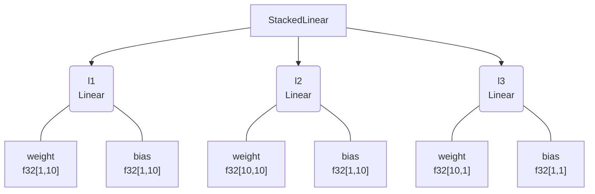
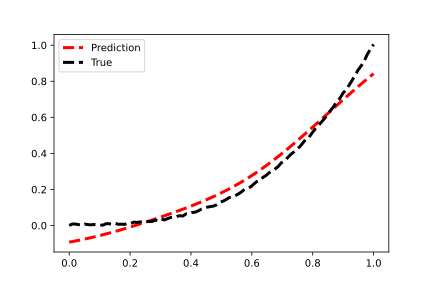

<h1 align="center" style="font-family:Monospace" >🌲Pytreeclass🌲</h1>
<h2 align="center">Write pytorch-like layers with rich visualizations in JAX.</h2>

[**Installation**](#Installation)
|[**Description**](#Description)
|[**Quick Example**](#QuickExample)
|[**More**](#More)


[](https://colab.research.google.com/drive/1bkYr-5HidtRSXFFBlvYqFa5pc5fQK_7-?usp=sharing)
[](https://pepy.tech/project/pytreeclass)
[](https://codecov.io/gh/ASEM000/pytreeclass)

<!-- [](https://pepy.tech/project/kernex) -->

## 🛠️ Installation<a id="Installation"></a>

```python
pip install pytreeclass
```

## 📖 Description<a id="Description"></a>

A JAX compatible `dataclass` like datastructure with the following functionalities

- Create PyTorch like NN classes like [equinox](https://github.com/patrick-kidger/equinox) and [Treex](https://github.com/cgarciae/treex)
- Provides rich visualizations for pytrees wrapped with `@treeclass`.
- Boolean indexing on Pytrees in functional style similar to jax.numpy. e.g. `x.at[x<0].set(0) `
- Apply math/numpy operations like [tree-math](https://github.com/google/tree-math)


## ⏩ Quick Example <a id="QuickExample">

### 🏗️ Create simple MLP
```python
import jax
from jax import numpy as jnp
from pytreeclass import treeclass,tree_viz

@treeclass
class Linear :
   weight : jnp.ndarray
   bias   : jnp.ndarray

   def __init__(self,key,in_dim,out_dim):
       self.weight = jax.random.normal(key,shape=(in_dim, out_dim)) * jnp.sqrt(2/in_dim)
       self.bias = jnp.ones((1,out_dim))

   def __call__(self,x):
       return x @ self.weight + self.bias

@treeclass
class StackedLinear:
   l1 : Linear
   l2 : Linear
   l3 : Linear

   def __init__(self,key,in_dim,out_dim,hidden_dim):
       keys= jax.random.split(key,3)

       self.l1 = Linear(key=keys[0],in_dim=in_dim,out_dim=hidden_dim)
       self.l2 = Linear(key=keys[1],in_dim=hidden_dim,out_dim=hidden_dim)
       self.l3 = Linear(key=keys[2],in_dim=hidden_dim,out_dim=out_dim)

   def __call__(self,x):
       x = self.l1(x)
       x = jax.nn.tanh(x)
       x = self.l2(x)
       x = jax.nn.tanh(x)
       x = self.l3(x)

       return x
       
model = StackedLinear(in_dim=1,out_dim=1,hidden_dim=10,key=jax.random.PRNGKey(0)) 

x = jnp.linspace(0,1,100)[:,None]
y = x**3 + jax.random.uniform(jax.random.PRNGKey(0),(100,1))*0.01
```
### 🎨 Visualize

<div align="center">
<table>
<tr>
 <td align = "center"> summary </td> <td align = "center">tree_box</td><td align = "center">tree_diagram</td>
</tr>
<tr>
 
<td>

```python
 
 **summary**
>>> print(tree_viz.summary(model))
┌──────┬───────┬─────────┬─────────────────┐
│Type  │Param #│Size     │Config           │
├──────┼───────┼─────────┼─────────────────┤
│Linear│20     │80.000 B │bias=f32[1,10]   │
│      │       │         │weight=f32[1,10] │
├──────┼───────┼─────────┼─────────────────┤
│Linear│110    │440.000 B│bias=f32[1,10]   │
│      │       │         │weight=f32[10,10]│
├──────┼───────┼─────────┼─────────────────┤
│Linear│11     │44.000 B │bias=f32[1,1]    │
│      │       │         │weight=f32[10,1] │
└──────┴───────┴─────────┴─────────────────┘
Total params :	141
Inexact params:	141
Other params:	0
--------------------------------------------
Total size :	564.000 B
Inexact size:	564.000 B
Other size:	0.000 B
============================================
```
</td>

 <td>
 
```python
>>> print(tree_viz.tree_box(model,array=x))
# using jax.eval_shape (no-flops operation)
# ** note ** : the created modules 
# in __init__ should be in the same order
# where they are called in __call__
┌─────────────────────────────────────┐
│StackedLinear(Parent)                │
├─────────────────────────────────────┤
│┌────────────┬────────┬─────────────┐│
││            │ Input  │ f32[100,1]  ││
││ Linear(l1) │────────┼─────────────┤│
││            │ Output │ f32[100,10] ││
│└────────────┴────────┴─────────────┘│
│┌────────────┬────────┬─────────────┐│
││            │ Input  │ f32[100,10] ││
││ Linear(l2) │────────┼─────────────┤│
││            │ Output │ f32[100,10] ││
│└────────────┴────────┴─────────────┘│
│┌────────────┬────────┬─────────────┐│
││            │ Input  │ f32[100,10] ││
││ Linear(l3) │────────┼─────────────┤│
││            │ Output │ f32[100,1]  ││
│└────────────┴────────┴─────────────┘│
└─────────────────────────────────────┘
```
</td>
 
<td>

```python
 >>> print(tree_viz.tree_diagram(model))
StackedLinear
    ├── l1=Linear
    │   ├── weight=f32[1,10]
    │   └── bias=f32[1,10]  
    ├── l2=Linear
    │   ├── weight=f32[10,10]
    │   └── bias=f32[1,10]  
    └──l3=Linear
        ├── weight=f32[10,1]
        └── bias=f32[1,1]  
```
 </td> 

</tr>
 
<tr>
 
 </tr>
</table>


 

  
<table>
<tr><td align = "center" > mermaid.io (Native support in Github/Notion)</td></tr>
<tr>
 
<td>

```python
# generate mermaid diagrams
# print(tree_viz.tree_mermaid(model)) # generate core syntax
>>> tree_viz.save_viz(model,filename="test_mermaid",method="tree_mermaid_md") 
# use `method="tree_mermaid_html"` to save as html
 ```

 

 
</td>
 

</tr>
 </table>

 </div>

## 🔢 More<a id="More"></a>

<details><summary>Train from scratch</summary>
 
```python
 
x = jnp.linspace(0,1,100)[:,None]
y = x**3 + jax.random.uniform(jax.random.PRNGKey(0),(100,1))*0.01


def loss_func(model,x,y):
   return jnp.mean((model(x)-y)**2 )

@jax.jit
def update(model,x,y):
   value,grads = jax.value_and_grad(loss_func)(model,x,y)
   # no need to use `jax.tree_map` to update the model
   #  as it model is wrapped by @treeclass
   return value , model-1e-3*grads

for _ in range(1,10_001):
   value,model = update(model,x,y)

plt.plot(x,model(x),'--r',label = 'Prediction',linewidth=3)
plt.plot(x,y,'--k',label='True',linewidth=3)
plt.legend()
```
 


</details>

<details>

<summary>Using out-of-place indexing `.at[].set()` and `.at[].get()` on Pytrees</summary>

Similar to JAX pytreeclass provides `.at` property for out-of-place update.

```python

# get layer1
layer1 = model.l1

# layer1 repr
>>> print(f"{layer1!r}")
Linear(weight=f32[1,10],bias=f32[1,10])

# layer1 str
>>> print(f"{layer1!s}")
Linear(
  weight=
    [[-2.55655     1.674097    0.07847876  0.48010758 -1.9021134  -0.95792925
       0.27486905  0.6492373  -0.51447827  1.077894  ]],
  bias=
    [[1.0345106  0.9914236  0.9971589  0.9965508  1.1548151  0.99296653
      0.9731281  0.9994397  0.9537985  1.0100957 ]])

# get only positive values
>>> print(layer1.at[layer1>0].get())
Linear(
  weight=
    [1.674097   0.07847876 0.48010758 0.27486905 0.6492373  1.077894  ],
  bias=
    [1.0345106  0.9914236  0.9971589  0.9965508  1.1548151  0.99296653
     0.9731281  0.9994397  0.9537985  1.0100957 ])

# set negative values to 0
>>> print(layer1.at[layer1<0].set(0))
Linear(
  weight=
    [[0.         1.674097   0.07847876 0.48010758 0.         0.
      0.27486905 0.6492373  0.         1.077894  ]],
  bias=
    [[1.0345106  0.9914236  0.9971589  0.9965508  1.1548151  0.99296653
      0.9731281  0.9994397  0.9537985  1.0100957 ]])

```

</details>

<details>
<summary>Perform Math operations on Pytrees</summary>

```python
@treeclass
class Test :
  a : float
  b : float
  c : float
  name : str = static_field() # ignore from jax computations


# basic operations
A = Test(10,20,30,'A')
assert (A + A) == Test(20,40,60,'A')
assert (A - A) == Test(0,0,0,'A')
assert (A*A).reduce_mean() == 1400
assert (A + 1) == Test(11,21,31,'A')

# selective operations

# only add 1 to field `a`
# all other fields are set to None and returns the same class
assert (A['a'] + 1) == Test(11,None,None,'A')

# use `|` to merge classes by performing ( left_node or  right_node )
Aa = A['a'] + 10 # Test(a=20,b=None,c=None,name=A)
Ab = A['b'] + 10 # Test(a=None,b=30,c=None,name=A)

assert (Aa | Ab | A ) == Test(20,30,30,'A')

# indexing by class
assert A[A>10]  == Test(a=None,b=20,c=30,name='A')


# Register custom operations
B = Test([10,10],20,30,'B')
B.register_op( func=lambda node:node+1,name='plus_one')
assert B.plus_one() == Test(a=[11, 11],b=21,c=31,name='B')


# Register custom reduce operations ( similar to functools.reduce)
C = Test(jnp.array([10,10]),20,30,'C')

C.register_op(
    func=jnp.prod,            # function applied on each node
    name='product',           # name of the function
    reduce_op=lambda x,y:x*y, # function applied between nodes (accumulated * current node)
    init_val=1                # initializer for the reduce function
                )

# product applies only on each node
# and returns an instance of the same class
assert C.product() == Test(a=100,b=20,c=30,name='C')

# `reduce_` + name of the registered function (`product`)
# reduces the class and returns a value
assert C.reduce_product() == 60000
```

</details>
