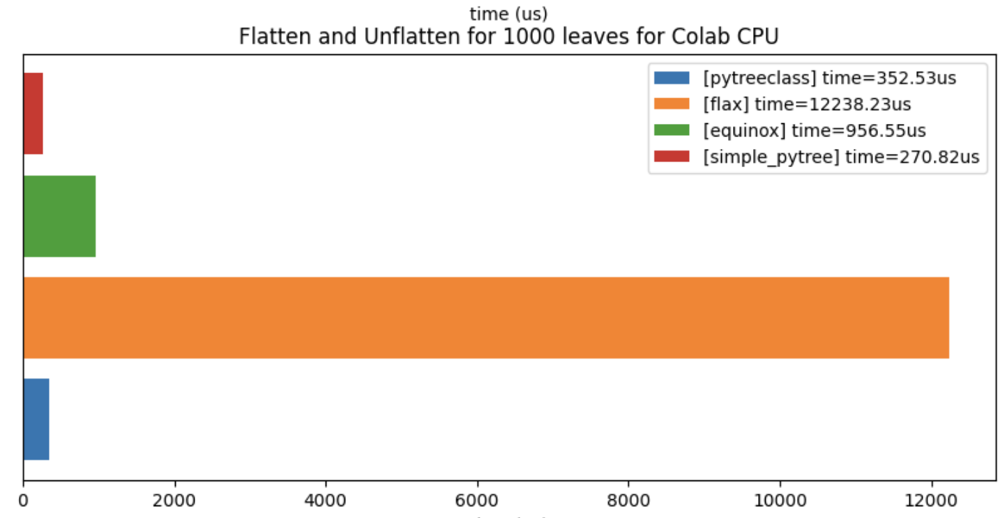

<!-- <h1 align="center" style="font-family:Monospace" >Py🌲Class</h1> -->
<h5 align="center">
 <br>

<br>

[**Installation**](#installation)
|[**Description**](#description)
|[**Quick Example**](#quick_example)
|[**StatefulComputation**](#stateful_computation)
|[**Benchamrks**](#more)
|[**Acknowledgements**](#acknowledgements)


[](https://colab.research.google.com/github/ASEM000/PyTreeClass/blob/main/assets/intro.ipynb)
[](https://pepy.tech/project/pytreeclass)
[](https://codecov.io/gh/ASEM000/pytreeclass)
[](https://pytreeclass.readthedocs.io/en/latest/?badge=latest)

[](https://zenodo.org/badge/latestdoi/512717921)

[](https://www.codefactor.io/repository/github/asem000/pytreeclass)

</h5>

## 🛠️ Installation<a id="installation"></a>

```python
pip install pytreeclass
```

**Install development version**

```python
pip install git+https://github.com/ASEM000/PyTreeClass
```

## 📖 Description<a id="description"></a>

`PyTreeClass` is a JAX-compatible class builder to create and operate on stateful JAX PyTrees in a performant and intuitive way, by building on familiar concepts found in `numpy`, `dataclasses`, and others.

See [documentation](https://pytreeclass.readthedocs.io/en/latest/notebooks/getting_started.html) and [🍳 Common recipes](https://pytreeclass.readthedocs.io/en/latest/notebooks/common_recipes.html) to check if this library is a good fit for your work. _If you find the package useful consider giving it a 🌟._

## ⏩ Quick Example <a id="quick_example">

<div align="center">
<table>
<tr><td align="center"></td></tr>
<tr>
<td>

```python
import jax
import jax.numpy as jnp
import pytreeclass as pytc

@pytc.autoinit
class Tree(pytc.TreeClass):
    a: float = 1.0
    b: tuple[float, float] = (2.0, 3.0)
    c: jax.Array = jnp.array([4.0, 5.0, 6.0])

    def __call__(self, x):
        return self.a + self.b[0] + self.c + x


tree = Tree()
mask = jax.tree_map(lambda x: x > 5, tree)
tree = tree\
       .at["a"].set(100.0)\
       .at["b"].at[0].set(10.0)\
       .at[mask].set(100.0)

print(tree)
# Tree(a=100.0, b=(10.0, 3.0), c=[  4.   5. 100.])

print(pytc.tree_diagram(tree))
# Tree
# ├── .a=100.0
# ├── .b:tuple
# │   ├── [0]=10.0
# │   └── [1]=3.0
# └── .c=f32[3](μ=36.33, σ=45.02, ∈[4.00,100.00])

print(pytc.tree_summary(tree))
# ┌─────┬──────┬─────┬──────┐
# │Name │Type  │Count│Size  │
# ├─────┼──────┼─────┼──────┤
# │.a   │float │1    │      │
# ├─────┼──────┼─────┼──────┤
# │.b[0]│float │1    │      │
# ├─────┼──────┼─────┼──────┤
# │.b[1]│float │1    │      │
# ├─────┼──────┼─────┼──────┤
# │.c   │f32[3]│3    │12.00B│
# ├─────┼──────┼─────┼──────┤
# │Σ    │Tree  │6    │12.00B│
# └─────┴──────┴─────┴──────┘

# ** pass it to jax transformations **
# works with jit, grad, vmap, etc.

@jax.jit
@jax.grad
def sum_tree(tree: Tree, x):
    return sum(tree(x))

print(sum_tree(tree, 1.0))
# Tree(a=3.0, b=(3.0, 0.0), c=[1. 1. 1.])
```

</td>

</tr>
</table>
</div>

## 📜 Stateful computations<a id="stateful_computation"></a>

[Under jax.jit jax requires states to be explicit](https://jax.readthedocs.io/en/latest/jax-101/07-state.html?highlight=state), this means that for any class instance; variables needs to be separated from the class and be passed explictly. However when using `TreeClass` no need to separate the instance variables ; instead the whole instance is passed as a state.

Using the following pattern,Updating state **functionally** can be achieved under `jax.jit`

<div align="center">
<table>
<tr><td align="center"></td></tr>
<tr>
<td>

```python
import jax
import pytreeclass as pytc

class Counter(pytc.TreeClass):
    def __init__(self, calls: int = 0):
        self.calls = calls

    def increment(self):
        self.calls += 1
counter = Counter() # Counter(calls=0)
```

</td>

</tr>
</table>
</div>

Here, we define the update function. Since the increment method mutate the internal state, thus we need to use the functional approach to update the state by using `.at`. To achieve this we can use `.at[method_name].__call__(*args,**kwargs)`, this functional call will return the value of this call and a _new_ model instance with the update state.

<div align="center">
<table>
<tr><td align="center"></td></tr>
<tr>
<td>

```python
@jax.jit
def update(counter):
    value, new_counter = counter.at["increment"]()
    return new_counter

for i in range(10):
    counter = update(counter)

print(counter.calls) # 10
```

</td>

</tr>
</table>
</div>

</details>

## ➕ Benchmarks<a id="more"></a>

<details>
<summary>Benchmark flatten/unflatten compared to Flax and Equinox </summary>

<a href="https://colab.research.google.com/github/ASEM000/PyTreeClass/blob/main/assets/benchmark_flatten_unflatten.ipynb" target="_parent"></a>

<table>

<tr><td align="center">CPU</td><td align="center">GPU</td></tr>

<tr>

<td></td>

</tr>

</table>

</details>

<details>

<summary>Benchmark simple training against `flax` and `equinox` </summary>

Training simple sequential linear benchmark against `flax` and `equinox`

<table>

<tr>
<td align="center">Num of layers</td>
<td align="center">Flax/PyTC time<br><a href="https://colab.research.google.com/github/ASEM000/PyTreeClass/blob/main/assets/benchmark_nn_training_flax.ipynb" target="_parent"></a></td>
<td align="center">Equinox/PyTC time<br> <a href="https://colab.research.google.com/github/ASEM000/PyTreeClass/blob/main/assets/benchmark_nn_training_equinox.ipynb" target="_parent"></a></td>
</tr>

<tr>
<td align="center">10</td>
<td align="center">1.427</td>
<td align="center">6.671</td>
</tr>

<tr>
<td align="center">100</td>
<td align="center">1.1130</td>
<td align="center">2.714</td>
</tr>

</table>

</details>

## 📙 Acknowledgements<a id="acknowledgements"></a>

- [Lenses](https://hackage.haskell.org/package/lens)
- [Treex](https://github.com/cgarciae/treex), [Equinox](https://github.com/patrick-kidger/equinox), [tree-math](https://github.com/google/tree-math), [Flax PyTreeNode](https://github.com/google/flax/commit/291a5f65549cf4522f0de033451cd83c0d0168d9), [TensorFlow](https://www.tensorflow.org), [PyTorch](https://pytorch.org)
- [Lovely JAX](https://github.com/xl0/lovely-jax)
