```mermaid

flowchart LR
    id15696277213149321320(<b>StackedLinear</b>)
    id15696277213149321320--->id11876010482821707549("<b>l1</b>:Linear")
    id11876010482821707549--->|"10 leaf<br>40.00B"|id12625879399672750750("<b>weight</b>:Array=f32[1,10](μ=-0.04, σ=1.55, ∈[-3.69,1.54])")
    id15696277213149321320--->id5339875373373139095("<b>l1</b>:Linear")
    id5339875373373139095--->|"10 leaf<br>40.00B"|id13172945660170386820("<b>bias</b>:Array=f32[1,10](μ=1.00, σ=0.00, ∈[1.00,1.00])")
    id15696277213149321320--->id6287638614072342474("<b>l2</b>:Linear")
    id6287638614072342474--->|"10 leaf<br>40.00B"|id1175353021666702085("<b>weight</b>:Array=f32[10,1](μ=-0.28, σ=0.41, ∈[-0.91,0.36])")
    id15696277213149321320--->id17320446376606480513("<b>l2</b>:Linear")
    id17320446376606480513--->|"1 leaf<br>4.00B"|id15467604975849568978("<b>bias</b>:Array=f32[1,1](μ=1.00, σ=0.00, ∈[1.00,1.00])")
```

```mermaid
flowchart LR
    id15696277213149321320(<b>StackedLinear</b>)
    id15696277213149321320--->|"20 leaf<br>80.00B"|id10921451029673043053("<b>l1</b>:Linear=Linear(
    weight=f32[1,10](μ=-0.04, σ=1.55, ∈[-3.69,1.54]), 
    bias=f32[1,10](μ=1.00, σ=0.00, ∈[1.00,1.00])
)")
    id15696277213149321320--->|"11 leaf<br>44.00B"|id1737644014573985902("<b>l2</b>:Linear=Linear(
    weight=f32[10,1](μ=-0.28, σ=0.41, ∈[-0.91,0.36]), 
    bias=f32[1,1](μ=1.00, σ=0.00, ∈[1.00,1.00])
)")
```

<!-- <h1 align="center" style="font-family:Monospace" >Py🌲Class</h1> -->
<h5 align="center">
 <br>

<br>

[**Installation**](#Installation)
|[**Description**](#Description)
|[**Quick Example**](#QuickExample)
|[**Filtering**](#Filtering)
|[**StatefulComputation**](#StatefulComputation)
|[**Applications**](#Applications)|
[**Acknowledgements**](#Acknowledgements)

<!-- |[**Benchmarking**](#Benchmarking) -->


[](https://colab.research.google.com/drive/1bkYr-5HidtRSXFFBlvYqFa5pc5fQK_7-?usp=sharing)
[](https://pepy.tech/project/pytreeclass)
[](https://codecov.io/gh/ASEM000/pytreeclass)
<!-- [](https://pytreeclass.readthedocs.io/en/latest/?badge=latest) -->

[](https://zenodo.org/badge/latestdoi/512717921)


</h5>

**This is v0.2 branch, for previous `PyTreeClass` use main branch**

## 🛠️ Installation<a id="Installation"></a>

<!-- ```python
pip install pytreeclass
``` -->

**Install development version**

```python
pip install git+https://github.com/ASEM000/PyTreeClass
```

## 📖 Description<a id="Description"></a>

`PyTreeClass` is a JAX-compatible `dataclass`-like decorator to create and operate on stateful JAX PyTrees.

The package aims to achieve _two goals_:

1. 🔒 To maintain safe and correct behaviour by using _immutable_ modules with _functional_ API.
2. To achieve the **most intuitive** user experience in the `JAX` ecosystem by :
   - 🏗️ Defining layers similar to `PyTorch` or `TensorFlow` subclassing style.
   - ☝️ Filtering\Indexing layer values similar to `jax.numpy.at[].{get,set,apply,...}`
   - 🎨 Visualize defined layers in plethora of ways.

## ⏩ Quick Example <a id="QuickExample">

### 🏗️ Create simple MLP <a id="Pytorch">

```python
import jax
import jax.numpy as jnp
import pytreeclass as pytc

@pytc.treeclass
class Linear :
   weight : jax.Array   # <- equivalent to nn.Parameter
   bias   : jax.Array   # <- equivalent to nn.Parameter

   def __init__(self,key,in_dim,out_dim):
       self.weight = jax.random.normal(key,shape=(in_dim, out_dim)) * jnp.sqrt(2/in_dim)
       self.bias = jnp.ones((1,out_dim))

   def __call__(self,x):
       return x @ self.weight + self.bias

@pytc.treeclass
class StackedLinear:
    def __init__(self,key,in_dim,out_dim,hidden_dim):
        
        k1,k2 = jax.random.split(key,2)
        # Declaring l1,l2,l3 as dataclass_fields is optional
        # as l1,l2,l3 are Linear class that is already wrapped with @pytc.treeclass
        self.l1 = Linear(key=k1,in_dim=in_dim,out_dim=hidden_dim)
        self.l2 = Linear(key=k2,in_dim=hidden_dim,out_dim=out_dim)

    def __call__(self,x):
        x = self.l1(x)
        x = jax.nn.tanh(x)
        x = self.l2(x)
        return x

NN = StackedLinear(in_dim=1,out_dim=1,hidden_dim=10,key=jax.random.PRNGKey(0))
```

### 🎨 Visualize<a id="Viz">

<details>

<div align="center">
<table>
<tr>
 <td align = "center"> `tree_summary` </td> <td align = "center">`tree_diagram`</td><td align = "center">mermaid.io (Native support in Github/Notion)</td>
</tr>

<tr>
<td>

```python
print(pytc.tree_summary(NN))

┌─────────┬─────────────┬─────┬───────┐
│Name     │Type         │Count│Size   │
├─────────┼─────────────┼─────┼───────┤
│l1.weight│f32[1,10]    │10   │40.00B │
├─────────┼─────────────┼─────┼───────┤
│l1.bias  │f32[1,10]    │10   │40.00B │
├─────────┼─────────────┼─────┼───────┤
│l2.weight│f32[10,1]    │10   │40.00B │
├─────────┼─────────────┼─────┼───────┤
│l2.bias  │f32[1,1]     │1    │4.00B  │
├─────────┼─────────────┼─────┼───────┤
│Σ        │StackedLinear│31   │124.00B│
└─────────┴─────────────┴─────┴───────┘
```


</td>


<td>

```python
print(pytc.tree_diagram(NN))
StackedLinear
    ├── l1:Linear
    │   ├── weight=f32[1,10](μ=-0.04, σ=1.55, ∈[-3.69,1.54])
    │   └── bias=f32[1,10](μ=1.00, σ=0.00, ∈[1.00,1.00])
    └── l2:Linear
        ├── weight=f32[10,1](μ=-0.28, σ=0.41, ∈[-0.91,0.36])
        └── bias=f32[1,1](μ=1.00, σ=0.00, ∈[1.00,1.00])
```


 </td>


<td>

```python
print(pytc.tree_mermaid(NN))
```




</td>

</tr>

<tr>

<td>

**Trim the tree at a certain `depth`**
```python
print(pytc.tree_summary(NN, depth=1))
┌────┬─────────────┬─────┬───────┐
│Name│Type         │Count│Size   │
├────┼─────────────┼─────┼───────┤
│l1  │Linear       │20   │80.00B │
├────┼─────────────┼─────┼───────┤
│l2  │Linear       │11   │44.00B │
├────┼─────────────┼─────┼───────┤
│Σ   │StackedLinear│31   │124.00B│
└────┴─────────────┴─────┴───────┘
```


</td>


<td>

**Trim the tree at a certain `depth`**

```python
print(pytc.tree_diagram(NN, depth=1))
StackedLinear
    ├── l1=Linear(
            weight=f32[1,10](μ=-0.04, σ=1.55, ∈[-3.69,1.54]), 
            bias=f32[1,10](μ=1.00, σ=0.00, ∈[1.00,1.00])
        )
    └── l2=Linear(
            weight=f32[10,1](μ=-0.28, σ=0.41, ∈[-0.91,0.36]), 
            bias=f32[1,1](μ=1.00, σ=0.00, ∈[1.00,1.00])
        )

```
</td>


<td>

**Trim the tree at a certain `depth`**

```python
print(pytc.tree_mermaid(NN, depth=1))
```


</td>


</tr>


 </table>

 </div>

</details>

### ☝️ Advanced Indexing with `.at[]` <a id="Indexing">

<details>

`PyTreeClass` offers 3 means of indexing through `.at[]`

1. Indexing by boolean mask.
2. Indexing by attribute name.
3. Indexing by Leaf index.

#### Index update by boolean mask

```python
@pytc.treeclass
class Tree:
    a:int = 1
    b:tuple[int] = (2,3)
    c:jax.Array = jnp.array([4,5,6])

tree= Tree()  
# Tree(a=1, b=(2, 3), c=i32[3](μ=5.00, σ=0.82, ∈[4,6]))

# lets create a mask for values > 4
mask = jax.tree_util.tree_map(lambda x: x>4, tree)

print(mask)  
# Tree(a=False, b=(False, False), c=[False  True  True])
```

**`.at[mask].get()`**
```python
print(tree.at[mask].get())
# Tree(a=None, b=(None, None), c=[5 6])
```

**`.at[mask].set(...)`**
```python
print(tree.at[mask].set(10))
# Tree(a=1, b=(2, 3), c=[ 4 10 10])
```

**`.at[mask].apply(...)`**
```python
print(tree.at[mask].apply(lambda x: 10))
# Tree(a=1, b=(2, 3), c=[ 4 10 10])
```

#### Index update by attribute name

```python
@pytc.treeclass
class Tree:
    a:int = 1
    b:tuple[int] = (2,3)
    c:jax.Array = jnp.array([4,5,6])

tree= Tree()  
# Tree(a=1, b=(2, 3), c=i32[3](μ=5.00, σ=0.82, ∈[4,6]))

```

**`.at[attribute_name].get()`**
```python
print(tree.at["a"].get())
# Tree(a=1, b=(None, None), c=None)
```

**`.at[attribute_name].set(...)`**
```python
print(tree.at["a"].set(10))
# Tree(a=10, b=(2, 3), c=[4 5 6])
```

**`.at[attribute_name].apply(...)`**
```python
print(tree.at[mask].apply(lambda x: 10))
# Tree(a=10, b=(2, 3), c=[4 5 6])
```

#### Index update by integer index

```python
@pytc.treeclass
class Tree:
    a:int = 1
    b:tuple[int] = (2,3)
    c:jax.Array = jnp.array([4,5,6])

tree= Tree()  
# Tree(a=1, b=(2, 3), c=i32[3](μ=5.00, σ=0.82, ∈[4,6]))

```

**`.at[integer_index].get()`**
```python
print(tree.at[0].get())
# Tree(a=1, b=(None, None), c=None)
```

**`.at[integer_index].set(...)`**
```python
print(tree.at[0].set(10))
# Tree(a=10, b=(2, 3), c=[4 5 6])
```

**`.at[integer_index].apply(...)`**
```python
print(tree.at[0].apply(lambda x: 10))
# Tree(a=10, b=(2, 3), c=[4 5 6])
```
</details>


## 📜 Stateful computations<a id="StatefulComputation"></a>
<details>

First, [Under jax.jit jax requires states to be explicit](https://jax.readthedocs.io/en/latest/jax-101/07-state.html?highlight=state), this means that for any class instance; variables needs to be separated from the class and be passed explictly. However when using @pytc.treeclass no need to separate the instance variables ; instead the whole instance is passed as a state.

Using the following pattern,Updating state **functionally** can be achieved under `jax.jit`

```python
import jax
import pytreeclass as pytc

@pytc.treeclass
class Counter:
    calls : int = 0

    def increment(self):
        self.calls += 1
counter = Counter() # Counter(calls=0)
```

Here, we define the update function. Since the increment method mutate the internal state, thus we need to use the functional approach to update the state by using `.at`. To achieve this we can use `.at[method_name].__call__(*args,**kwargs)`, this functional call will return the value of this call and a _new_ model instance with the update state.

```python
@jax.jit
def update(counter):
    value, new_counter = counter.at["increment"]()
    return new_counter

for i in range(10):
    counter = update(counter)

print(counter.calls) # 10
```

</details>


#### 📄 **_Advanced_** Registering custom user-defined classes to work with visualization and indexing tools.

<details>

Similar to [`jax.tree_util.register_pytree_node`](https://jax.readthedocs.io/en/latest/pytrees.html#extending-pytrees), `PyTreeClass` register common data structures and `treeclass` wrapped classes to figure out how to define the names, types, index, and metadatas of certain leaf along its path.

Here is an example of registering
```python

class Tree:
    def __init__(self, a, b):
        self.a = a
        self.b = b
    
    def __repr__(self) -> str:
        return f"{self.__class__.__name__}(a={self.a}, b={self.b})"


# jax flatten rule
def tree_flatten(tree):
    return (tree.a, tree.b), None

# jax unflatten rule
def tree_unflatten(_, children):
    return Tree(*children)

# PyTreeClass flatten rule
def pytc_tree_flatten(tree):
    names = ("a", "b")
    types = (type(tree.a), type(tree.b))
    indices = ((0,2), (1,2))
    metadatas = (None, None)
    return [*zip(names, types, indices, metadatas)]


# Register with `jax`
jax.tree_util.register_pytree_node(Tree, tree_flatten, tree_unflatten)

# Register the `Tree` class trace function to support indexing
pytc.register_pytree_node_trace(Tree, pytc_tree_flatten)

tree = Tree(1, 2)

# works with jax
jax.tree_util.tree_leaves(tree)  # [1, 2]

# works with PyTreeClass viz tools
print(pytc.tree_summary(tree))

# ┌────┬────┬─────┬──────┐
# │Name│Type│Count│Size  │
# ├────┼────┼─────┼──────┤
# │a   │int │1    │28.00B│
# ├────┼────┼─────┼──────┤
# │b   │int │1    │28.00B│
# ├────┼────┼─────┼──────┤
# │Σ   │Tree│2    │56.00B│
# └────┴────┴─────┴──────┘

```

After registeration, you can use internal tools like
- `pytc.tree_map_with_trace`
- `pytc.tree_leaves_with_trace`
- `pytc.tree_flatten_with_trace`

More details on that soon.

</details>

## 📙 Acknowledgements<a id="Acknowledgements"></a>

- [Farid Talibli (for visualization link generation backend)](https://www.linkedin.com/in/frdt98)
- [Treex](https://github.com/cgarciae/treex), [Equinox](https://github.com/patrick-kidger/equinox), [tree-math](https://github.com/google/tree-math), [Flax](https://github.com/google/flax), [TensorFlow](https://www.tensorflow.org), [PyTorch](https://pytorch.org)
- [Lovely JAX](https://github.com/xl0/lovely-jax)
