```mermaid

flowchart LR
    id15696277213149321320(<b>Tree</b>)
    id15696277213149321320--->|"1 leaf<br>28.00B"|id4205845433746830897("<b>a</b>:int=1")
    id15696277213149321320--->|"2 leaf<br>48.00B"|id4682191244783855647("<b>b</b>:tuple=(..., ...)")
    id15696277213149321320--->|"3 leaf<br>12.00B"|id14652085615030570957("<b>c</b>:ArrayImpl=f32[3](μ=5.00, σ=0.82, ∈[4.00,6.00])")
```

```mermaid
flowchart LR
    id15696277213149321320(<b>Tree</b>)
    id15696277213149321320--->id4205845433746830897("<b>a</b>:int=1")
    id15696277213149321320--->|"1 leaf<br>24.00B"|id8168961130706115346("<b>b</b>:tuple")
    id8168961130706115346--->|"1 leaf<br>24.00B"|id2766159651176208202("<b>[0]</b>:float=2.0")
    id15696277213149321320--->|"1 leaf<br>24.00B"|id12408280303145007954("<b>b</b>:tuple")
    id12408280303145007954--->|"1 leaf<br>24.00B"|id7897116322308127883("<b>[1]</b>:float=3.0")
    id15696277213149321320--->id14652085615030570957("<b>c</b>:ArrayImpl=f32[3](μ=5.00, σ=0.82, ∈[4.00,6.00])")
```

<!-- <h1 align="center" style="font-family:Monospace" >Py🌲Class</h1> -->
<h5 align="center">
 <br>

<br>

[**Installation**](#Installation)
|[**Description**](#Description)
|[**Quick Example**](#QuickExample)
|[**StatefulComputation**](#StatefulComputation)
[**Acknowledgements**](#Acknowledgements)

<!-- |[**Benchmarking**](#Benchmarking) -->


[](https://colab.research.google.com/drive/1bkYr-5HidtRSXFFBlvYqFa5pc5fQK_7-?usp=sharing)
[](https://pepy.tech/project/pytreeclass)
[](https://codecov.io/gh/ASEM000/pytreeclass)

<!-- [](https://pytreeclass.readthedocs.io/en/latest/?badge=latest) -->


[](https://zenodo.org/badge/latestdoi/512717921)


</h5>

**This is v0.2 branch, for previous `PyTreeClass` use main branch**

## 🛠️ Installation<a id="Installation"></a>

<!-- ```python
pip install pytreeclass
``` -->

**Install development version**

```python
pip install git+https://github.com/ASEM000/PyTreeClass
```

## 📖 Description<a id="Description"></a>

`PyTreeClass` is a JAX-compatible `dataclass`-like decorator to create and operate on stateful JAX PyTrees.

The package aims to achieve _two goals_:

1. 🔒 To maintain safe and correct behaviour by using _immutable_ modules with _functional_ API.
2. To achieve the **most intuitive** user experience in the `JAX` ecosystem by :
   - 🏗️ Defining layers similar to `PyTorch` or `TensorFlow` subclassing style.
   - ☝️ Filtering\Indexing layer values similar to `jax.numpy.at[].{get,set,apply,...}`
   - 🎨 Visualize defined layers in plethora of ways.

## ⏩ Quick Example <a id="QuickExample">

### 🏗️ Simple Tree example <a id="Example">

```python
import jax
import jax.numpy as jnp
import pytreeclass as pytc

@pytc.treeclass
class Tree:
    a:int = 1
    b:tuple[float] = (2.,3.)
    c:jax.Array = jnp.array([4.,5.,6.])

    def __call__(self, x):
        return self.a + self.b[0] + self.c + x

tree = Tree()
```

### 🎨 Visualize<a id="Viz">

<details>

<div align="center">
<table>
<tr>
 <td align = "center"> tree_summary</td> 
 <td align = "center">tree_diagram</td>
 <td align = "center">[tree_mermaid](https://mermaid.js.org)(Native support in Github/Notion)</td>
 <td align= "center"> tree_repr </td>
 <td align="center" > tree_str </td>

</tr>

<tr>
<td>

```python
print(pytc.tree_summary(tree, depth=1))
┌────┬──────┬─────┬──────┐
│Name│Type  │Count│Size  │
├────┼──────┼─────┼──────┤
│a   │int   │1    │28.00B│
├────┼──────┼─────┼──────┤
│b   │tuple │2    │48.00B│
├────┼──────┼─────┼──────┤
│c   │f32[3]│3    │12.00B│
├────┼──────┼─────┼──────┤
│Σ   │Tree  │6    │88.00B│
└────┴──────┴─────┴──────┘
```

</td>

<td>

```python

print(pytc.tree_diagram(tree, depth=1))
Tree
    ├── a=1
    ├── b=(..., ...)
    └── c=f32[3](μ=5.00, σ=0.82, ∈[4.00,6.00])
```

 </td>

<td>

```python
print(pytc.tree_mermaid(tree, depth=1))
```



</td>

<td>

```python
print(pytc.tree_repr(tree, depth=1))
Tree(a=1, b=(..., ...), c=f32[3](μ=5.00, σ=0.82, ∈[4.00,6.00]))
```

</td>

<td>

```python
print(pytc.tree_str(tree, depth=1))
Tree(a=1, b=(..., ...), c=[4. 5. 6.])
```

</td>

</tr>

<tr>

<td>

```python
print(pytc.tree_summary(tree, depth=2))
┌────┬──────┬─────┬──────┐
│Name│Type  │Count│Size  │
├────┼──────┼─────┼──────┤
│a   │int   │1    │28.00B│
├────┼──────┼─────┼──────┤
│b[0]│float │1    │24.00B│
├────┼──────┼─────┼──────┤
│b[1]│float │1    │24.00B│
├────┼──────┼─────┼──────┤
│c   │f32[3]│3    │12.00B│
├────┼──────┼─────┼──────┤
│Σ   │Tree  │6    │88.00B│
└────┴──────┴─────┴──────┘
```

</td>

<td>

```python
print(pytc.tree_diagram(tree, depth=2))
Tree
    ├── a=1
    ├── b:tuple
    │   ├── [0]=2.0
    │   └── [1]=3.0
    └── c=f32[3](μ=5.00, σ=0.82, ∈[4.00,6.00])
```

</td>

<td>

```python
print(pytc.tree_mermaid(tree, depth=2))
```



</td>

<td>

```python
print(pytc.tree_repr(tree, depth=2))
Tree(a=1, b=(2.0, 3.0), c=f32[3](μ=5.00, σ=0.82, ∈[4.00,6.00]))
```

</td>

<td>

```python
print(pytc.tree_str(tree, depth=2))
Tree(a=1, b=(2.0, 3.0), c=[4. 5. 6.])
```

</td>

</tr>

 </table>

 </div>

</details>

### 🏃 Working with `jax` transformation

<details>

Parameters are defined in `Tree` at the top of class definition similar to defining
`dataclasses.dataclass` field.
Lets optimize our parameters

```python

@jax.grad
def loss_func(tree:Tree, x:jax.Array):
    preds = jax.vmap(tree)(x)  # <--- vectorize the tree call over the leading axis
    return jnp.mean(preds**2)  # <--- return the mean squared error

@jax.jit
def train_step(tree:Tree, x:jax.Array):
    grads = loss_func(tree, x)
    # apply a small gradient step
    return jax.tree_util.tree_map(lambda x, g: x - 1e-3*g, tree, grads)

# lets freeze the non-differentiable parts of the tree
# in essence any non inexact type should be frozen to
# make the tree differentiable and work with jax transformations
jaxable_tree = jax.tree_util.tree_map(lambda x: pytc.freeze(x) if pytc.is_nondiff(x) else x, tree)

for epoch in range(1_000):
    jaxable_tree = train_step(jaxable_tree, jnp.ones([10,1]))

print(jaxable_tree)
# **the `frozen` params have "#" prefix**
# Tree(a=#1, b=(-4.7176366, 3.0), c=[2.4973059 2.760783  3.024264 ]) 


# unfreeze the tree
tree = jax.tree_util.tree_map(pytc.unfreeze, jaxable_tree, is_leaf=pytc.is_frozen)
print(tree)
# Tree(a=1, b=(-4.7176366, 3.0), c=[2.4973059 2.760783  3.024264 ])
```

</details>

### ☝️ Advanced Indexing with `.at[]` <a id="Indexing">

<details>

`PyTreeClass` offers 3 means of indexing through `.at[]`

1. Indexing by boolean mask.
2. Indexing by attribute name.
3. Indexing by Leaf index.

#### Index update by boolean mask

```python
tree= Tree()
# Tree(a=1, b=(2, 3), c=i32[3](μ=5.00, σ=0.82, ∈[4,6]))

# lets create a mask for values > 4
mask = jax.tree_util.tree_map(lambda x: x>4, tree)

print(mask)
# Tree(a=False, b=(False, False), c=[False  True  True])

print(tree.at[mask].get())
# Tree(a=None, b=(None, None), c=[5 6])

print(tree.at[mask].set(10))
# Tree(a=1, b=(2, 3), c=[ 4 10 10])

print(tree.at[mask].apply(lambda x: 10))
# Tree(a=1, b=(2, 3), c=[ 4 10 10])
```

#### Index update by attribute name

```python
tree= Tree()
# Tree(a=1, b=(2, 3), c=i32[3](μ=5.00, σ=0.82, ∈[4,6]))

print(tree.at["a"].get())
# Tree(a=1, b=(None, None), c=None)

print(tree.at["a"].set(10))
# Tree(a=10, b=(2, 3), c=[4 5 6])

print(tree.at["a"].apply(lambda x: 10))
# Tree(a=10, b=(2, 3), c=[4 5 6])
```

#### Index update by integer index

```python
tree= Tree()
# Tree(a=1, b=(2, 3), c=i32[3](μ=5.00, σ=0.82, ∈[4,6]))

print(tree.at[0].get())
# Tree(a=1, b=(None, None), c=None)

print(tree.at[0].set(10))
# Tree(a=10, b=(2, 3), c=[4 5 6])

print(tree.at[0].apply(lambda x: 10))
# Tree(a=10, b=(2, 3), c=[4 5 6])
```

</details>

## 📜 Stateful computations<a id="StatefulComputation"></a>

<details>

First, [Under jax.jit jax requires states to be explicit](https://jax.readthedocs.io/en/latest/jax-101/07-state.html?highlight=state), this means that for any class instance; variables needs to be separated from the class and be passed explictly. However when using @pytc.treeclass no need to separate the instance variables ; instead the whole instance is passed as a state.

Using the following pattern,Updating state **functionally** can be achieved under `jax.jit`

```python
import jax
import pytreeclass as pytc

@pytc.treeclass
class Counter:
    calls : int = 0

    def increment(self):
        self.calls += 1
counter = Counter() # Counter(calls=0)
```

Here, we define the update function. Since the increment method mutate the internal state, thus we need to use the functional approach to update the state by using `.at`. To achieve this we can use `.at[method_name].__call__(*args,**kwargs)`, this functional call will return the value of this call and a _new_ model instance with the update state.

```python
@jax.jit
def update(counter):
    value, new_counter = counter.at["increment"]()
    return new_counter

for i in range(10):
    counter = update(counter)

print(counter.calls) # 10
```

</details>

## ➕ More<a id="More"></a>

<details><summary>[Advanced] Registering custom user-defined classes to work with visualization and indexing tools. </summary>

Similar to [`jax.tree_util.register_pytree_node`](https://jax.readthedocs.io/en/latest/pytrees.html#extending-pytrees), `PyTreeClass` register common data structures and `treeclass` wrapped classes to figure out how to define the names, types, index, and metadatas of certain leaf along its path.

Here is an example of registering

```python

class Tree:
    def __init__(self, a, b):
        self.a = a
        self.b = b

    def __repr__(self) -> str:
        return f"{self.__class__.__name__}(a={self.a}, b={self.b})"


# jax flatten rule
def tree_flatten(tree):
    return (tree.a, tree.b), None

# jax unflatten rule
def tree_unflatten(_, children):
    return Tree(*children)

# PyTreeClass flatten rule
def pytc_tree_flatten(tree):
    names = ("a", "b")
    types = (type(tree.a), type(tree.b))
    indices = (0,1)
    metadatas = (None, None)
    return [*zip(names, types, indices, metadatas)]


# Register with `jax`
jax.tree_util.register_pytree_node(Tree, tree_flatten, tree_unflatten)

# Register the `Tree` class trace function to support indexing
pytc.register_pytree_node_trace(Tree, pytc_tree_flatten)

tree = Tree(1, 2)

# works with jax
jax.tree_util.tree_leaves(tree)  # [1, 2]

# works with PyTreeClass viz tools
print(pytc.tree_summary(tree))

# ┌────┬────┬─────┬──────┐
# │Name│Type│Count│Size  │
# ├────┼────┼─────┼──────┤
# │a   │int │1    │28.00B│
# ├────┼────┼─────┼──────┤
# │b   │int │1    │28.00B│
# ├────┼────┼─────┼──────┤
# │Σ   │Tree│2    │56.00B│
# └────┴────┴─────┴──────┘

```

After registeration, you can use internal tools like

- `pytc.tree_map_with_trace`
- `pytc.tree_leaves_with_trace`
- `pytc.tree_flatten_with_trace`

More details on that soon.

</details>

## 📙 Acknowledgements<a id="Acknowledgements"></a>

- [Farid Talibli (for visualization link generation backend)](https://www.linkedin.com/in/frdt98)
- [Treex](https://github.com/cgarciae/treex), [Equinox](https://github.com/patrick-kidger/equinox), [tree-math](https://github.com/google/tree-math), [Flax](https://github.com/google/flax), [TensorFlow](https://www.tensorflow.org), [PyTorch](https://pytorch.org)
- [Lovely JAX](https://github.com/xl0/lovely-jax)
