```mermaid

flowchart LR
    id0(<b>Tree</b>)
    id0 --- id1("</b>.a=1</b>")
    id0 --- id2("</b>.b=(...)</b>")
    id0 --- id3("</b>.c=f32[3](μ=5.00, σ=0.82, ∈[4.00,6.00])</b>")
```

<!-- <h1 align="center" style="font-family:Monospace" >Py🌲Class</h1> -->
<h5 align="center">
 <br>

<br>

[**Installation**](#installation)
|[**Description**](#description)
|[**Quick Example**](#quick_example)
|[**StatefulComputation**](#stateful_computation)
|[**More**](#more)
|[**Acknowledgements**](#acknowledgements)


[](https://colab.research.google.com/github/ASEM000/PyTreeClass/blob/main/assets/intro.ipynb)
[](https://pepy.tech/project/pytreeclass)
[](https://codecov.io/gh/ASEM000/pytreeclass)
[](https://pytreeclass.readthedocs.io/en/latest/?badge=latest)

[](https://zenodo.org/badge/latestdoi/512717921)


</h5>

**For previous `PyTreeClass` use v0.1 branch**

## 🛠️ Installation<a id="installation"></a>

```python
pip install pytreeclass
```

**Install development version**

```python
pip install git+https://github.com/ASEM000/PyTreeClass
```

## 📖 Description<a id="description"></a>

`PyTreeClass` is a JAX-compatible class builder to create and operate on stateful JAX PyTrees.

The package aims to achieve _two goals_:

1. 🔒 To maintain safe and correct behaviour by using _immutable_ modules with _functional_ API.
2. To achieve the **most intuitive** user experience in the `JAX` ecosystem by :
   - 🏗️ Defining layers similar to `PyTorch` or `TensorFlow` subclassing style.
   - ☝️ Filtering\Indexing layer values similar to `jax.numpy.at[].{get,set,apply,...}`
   - 🎨 Visualize defined layers in plethora of ways.

## ⏩ Quick Example <a id="quick_example">

### 🏗️ Simple Tree example

<div align="center">
<table>
<tr><td align="center"></td> <td align="center"></td></tr>
<tr>
<td>

```python
import jax
import jax.numpy as jnp
import pytreeclass as pytc


class Tree(pytc.TreeClass):
    a: int = 1
    b: tuple = (2, 3.)
    c: jax.Array = jnp.array([4., 5., 6.])

    def __call__(self, x):
        return self.a + self.b[0] + self.c + x


tree = Tree()
mask = jax.tree_map(lambda x: x > 5, tree)
tree = tree \
       .at["a"].set(10) \
       .at["b"].at[0].set(10) \
       .at[mask].set(100)

print(tree)
# Tree(a=10, b=(10, 3.0), c=[  4.   5. 100.])

print(pytc.tree_diagram(tree))
# Tree
# ├── .a=10
# ├── .b:tuple
# │   ├── [0]=10
# │   └── [1]=3.0
# └── .c=f32[3](μ=36.33, σ=45.02, ∈[4.00,100.00])

print(pytc.tree_summary(tree))
# ┌─────┬──────┬─────┐
# │Name │Type  │Count│
# ├─────┼──────┼─────┤
# │.a   │int   │1    │
# ├─────┼──────┼─────┤
# │.b[0]│int   │1    │
# ├─────┼──────┼─────┤
# │.b[1]│float │1    │
# ├─────┼──────┼─────┤
# │.c   │f32[3]│3    │
# ├─────┼──────┼─────┤
# │Σ    │Tree  │6    │
# └─────┴──────┴─────┘


# ** pass it to jax transformations **

# freeze all non-differentiable parameters to make it
# work with jax trnasformations
mask = jax.tree_map(pytc.is_nondiff, tree)
tree = tree.at[mask].apply(pytc.freeze)

@jax.jit
@jax.grad
def sum_tree(tree:Tree, x):
    # unfreeze before calling tree
    tree = tree.at[...].apply(pytc.unfreeze, is_leaf=pytc.is_frozen)
    return sum(tree(x))

print(sum_tree(tree, 1.0))
# Tree(a=#10, b=(#10, 0.0), c=[1. 1. 1.])
```

</td>

</tr>
</table>
</div>

### 🎨 Visualize<a id="Viz">

<details> <summary> Visualize PyTrees</summary>

<div align="center">
<table>
<tr>
 <td align = "center"> tree_summary</td> 
 <td align = "center">tree_diagram</td>
 <td align = "center">[tree_mermaid](https://mermaid.js.org)(Native support in Github/Notion)</td>
 <td align= "center"> tree_repr </td>
 <td align="center" > tree_str </td>

</tr>

<tr>
<td>

```python
print(pytc.tree_summary(tree, depth=1))
┌────┬──────┬─────┐
│Name│Type  │Count│
├────┼──────┼─────┤
│.a  │int   │1    │
├────┼──────┼─────┤
│.b  │tuple │1    │
├────┼──────┼─────┤
│.c  │f32[3]│3    │
├────┼──────┼─────┤
│Σ   │Tree  │5    │
└────┴──────┴─────┘
```

</td>

<td>

```python

print(pytc.tree_diagram(tree, depth=1))
Tree
├── .a=1
├── .b=(...)
└── .c=f32[3](μ=5.00, σ=0.82, ∈[4.00,6.00])
```

 </td>

<td>

```python
print(pytc.tree_mermaid(tree, depth=1))
```



</td>

<td>

```python
print(pytc.tree_repr(tree, depth=1))
Tree(a=1, b=(...), c=f32[3](μ=5.00, σ=0.82, ∈[4.00,6.00]))
```

</td>

<td>

```python
print(pytc.tree_str(tree, depth=1))
Tree(a=1, b=(...), c=[4. 5. 6.])
```

</td>

</tr>

<tr>

<td>

```python
print(pytc.tree_summary(tree, depth=2))
┌─────┬──────┬─────┐
│Name │Type  │Count│
├─────┼──────┼─────┤
│.a   │int   │1    │
├─────┼──────┼─────┤
│.b[0]│int   │1    │
├─────┼──────┼─────┤
│.b[1]│float │1    │
├─────┼──────┼─────┤
│.c   │f32[3]│3    │
├─────┼──────┼─────┤
│Σ    │Tree  │6    │
└─────┴──────┴─────┘
```

</td>

<td>

```python
print(pytc.tree_diagram(tree, depth=2))
Tree
├── .a=1
├── .b:tuple
│   ├── [0]=2.0
│   └── [1]=3.0
└── .c=f32[3](μ=5.00, σ=0.82, ∈[4.00,6.00])
```

</td>

<td>

```python
print(pytc.tree_mermaid(tree, depth=2))
```


</td>

<td>

```python
print(pytc.tree_repr(tree, depth=2))
Tree(a=1, b=(2.0, 3.0), c=f32[3](μ=5.00, σ=0.82, ∈[4.00,6.00]))
```

</td>

<td>

```python
print(pytc.tree_str(tree, depth=2))
Tree(a=1, b=(2.0, 3.0), c=[4. 5. 6.])
```

</td>

</tr>

 </table>

 </div>

</details>

### 🏃 Working with `jax` transformation

<details> <summary>Make arbitrary PyTrees work with jax transformations</summary>

Parameters are defined in `Tree` at the top of class definition similar to defining
`dataclasses.dataclass` field.
Lets optimize our parameters

```python

import pytreeclass as pytc
import jax
import jax.numpy as jnp


class Tree(pytc.TreeClass)
    a: int = 1
    b: tuple[float] = (2., 3.)
    c: jax.Array = jnp.array([4., 5., 6.])

    def __call__(self, x):
        return self.a + self.b[0] + self.c + x


tree = Tree()


@jax.grad
def loss_func(tree: Tree, x: jax.Array):
    tree = tree.at[...].apply(pytc.unfreeze, is_leaf=pytc.is_frozen)  # <--- unfreeze the tree before calling it
    preds = jax.vmap(tree)(x)  # <--- vectorize the tree call over the leading axis
    return jnp.mean(preds**2)  # <--- return the mean squared error


@jax.jit
def train_step(tree: Tree, x: jax.Array):
    grads = loss_func(tree, x)
    # apply a small gradient step
    return jax.tree_util.tree_map(lambda x, g: x - 1e-3 * g, tree, grads)


# lets freeze the non-differentiable parts of the tree
# in essence any non inexact type should be frozen to
# make the tree differentiable and work with jax transformations
jaxable_tree = jax.tree_util.tree_map(lambda x: pytc.freeze(x) if pytc.is_nondiff(x) else x, tree)

for epoch in range(1_000):
    jaxable_tree = train_step(jaxable_tree, jnp.ones([10, 1]))

print(jaxable_tree)
# **the `frozen` params have "#" prefix**
# Tree(a=#1, b=(-4.2826524, 3.0), c=[2.3924797 2.905778  3.4190805])


# unfreeze the tree
tree = jaxable_tree.at[...].apply(pytc.unfreeze, is_leaf=pytc.is_frozen)
# the previous line is equivalent to:
# >>> tree = jax.tree_util.tree_map(pytc.unfreeze, jaxable_tree, is_leaf=pytc.is_frozen)
print(tree)
# Tree(a=1, b=(-4.2826524, 3.0), c=[2.3924797 2.905778  3.4190805])

```

</details>

#### ☝️ Advanced Indexing with `.at[]` <a id="Indexing">

<details> <summary>Out-of-place updates using mask, attribute name or index</summary>

`PyTreeClass` offers 3 means of indexing through `.at[]`

1. Indexing by boolean mask.
2. Indexing by attribute name.
3. Indexing by Leaf index.

**Since `treeclass` wrapped class are immutable, `.at[]` operations returns new instance of the tree**

#### Index update by boolean mask

```python
tree = Tree()
# Tree(a=1, b=(2, 3), c=i32[3](μ=5.00, σ=0.82, ∈[4,6]))

# lets create a mask for values > 4
mask = jax.tree_util.tree_map(lambda x: x>4, tree)

print(mask)
# Tree(a=False, b=(False, False), c=[False  True  True])

print(tree.at[mask].get())
# Tree(a=None, b=(None, None), c=[5 6])

print(tree.at[mask].set(10))
# Tree(a=1, b=(2, 3), c=[ 4 10 10])

print(tree.at[mask].apply(lambda x: 10))
# Tree(a=1, b=(2, 3), c=[ 4 10 10])
```

#### Index update by attribute name

```python
tree = Tree()
# Tree(a=1, b=(2, 3), c=i32[3](μ=5.00, σ=0.82, ∈[4,6]))

print(tree.at["a"].get())
# Tree(a=1, b=(None, None), c=None)

print(tree.at["a"].set(10))
# Tree(a=10, b=(2, 3), c=[4 5 6])

print(tree.at["a"].apply(lambda x: 10))
# Tree(a=10, b=(2, 3), c=[4 5 6])
```

#### Index update by integer index

```python
tree = Tree()
# Tree(a=1, b=(2, 3), c=i32[3](μ=5.00, σ=0.82, ∈[4,6]))

print(tree.at[1].at[0].get())
# Tree(a=None, b=(2.0, None), c=None)

print(tree.at[1].at[0].set(10))
# Tree(a=1, b=(10, 3.0), c=[4. 5. 6.])

print(tree.at[1].at[0].apply(lambda x: 10))
# Tree(a=1, b=(10, 3.0), c=[4. 5. 6.])
```

### Mix, match , and chain index update

```python

import jax
import jax.numpy as jnp
import pytreeclass as pytc

class Tree(pytc.TreeClass):
    a: int = 1
    b: str = "b"
    c: float = 1.0
    d: bool = True
    e: tuple = (1, 2, 3)
    f: jax.Array = jax.numpy.array([1, 2, 3])

tree = Tree()

integer_mask = jax.tree_util.tree_map(lambda x: isinstance(x, int), tree)

tree = (
    tree
    .at["a"].set(10)
    .at["b"].set("B")
    .at["c"].set(10.0)
    .at["d"].set(False)
    .at["e"].at[0].set(10)  # set first element of tuple to 10
    .at["f"].apply(jnp.sin)  # apply to all elements in array
    .at[integer_mask].apply(float)  # cast all `int` to `float`
)

print(tree)
# Tree(
#   a=10.0,
#   b=B,
#   c=10.0,
#   d=0.0,
#   e=(10.0, 2.0, 3.0),
#   f=[0.841471  0.9092974 0.14112  ]
# )

```

</details>

<details>

<summary>

## 📜 Stateful computations<a id="stateful_computation"></a> </summary>

First, [Under jax.jit jax requires states to be explicit](https://jax.readthedocs.io/en/latest/jax-101/07-state.html?highlight=state), this means that for any class instance; variables needs to be separated from the class and be passed explictly. However when using `TreeClass` no need to separate the instance variables ; instead the whole instance is passed as a state.

Using the following pattern,Updating state **functionally** can be achieved under `jax.jit`

```python
import jax
import pytreeclass as pytc

class Counter(pytc.TreeClass):
    calls : int = 0

    def increment(self):
        self.calls += 1
counter = Counter() # Counter(calls=0)
```

Here, we define the update function. Since the increment method mutate the internal state, thus we need to use the functional approach to update the state by using `.at`. To achieve this we can use `.at[method_name].__call__(*args,**kwargs)`, this functional call will return the value of this call and a _new_ model instance with the update state.

```python
@jax.jit
def update(counter):
    value, new_counter = counter.at["increment"]()
    return new_counter

for i in range(10):
    counter = update(counter)

print(counter.calls) # 10
```

</details>

## ➕ More<a id="more"></a>

<details> <summary>Validate or convert inputs using callbacks</summary>

`PyTreeClass` includes `callbacks` in the `field` to apply a sequence of functions on input at setting the attribute stage. The callback is quite useful in several cases, for instance, to ensure a certain input type within a valid range. See example:

```python
import jax
import pytreeclass as pytc

def positive_int_callback(value):
    if not isinstance(value, int):
        raise TypeError("Value must be an integer")
    if value <= 0:
        raise ValueError("Value must be positive")
    return value


class Tree(pytc.TreeClass):
    in_features:int = pytc.field(callbacks=[positive_int_callback])


tree = Tree(1)
# no error

tree = Tree(0)
# ValueError: Error for field=`in_features`:
# Value must be positive

tree = Tree(1.0)
# TypeError: Error for field=`in_features`:
# Value must be an integer
```

</details>

<details>  <summary> Add leafwise math operations to PyTreeClass wrapped class</summary>

```python
import functools as ft
import pytreeclass as pytc
import jax
import jax.tree_util as jtu
import jax.numpy as jnp


class Tree(pytc.TreeClass, leafwise=True):
    a: int = 1
    b: tuple[float] = (2., 3.)
    c: jax.Array = jnp.array([4., 5., 6.])

    def __call__(self, x):
        return self.a + self.b[0] + self.c + x


tree = Tree()

tree + 100
# Tree(a=101, b=(102.0, 103.0), c=f32[3](μ=105.00, σ=0.82, ∈[104.00,106.00]))


@jax.grad
def loss_func(tree: Tree, x: jax.Array):
    tree = jtu.tree_map(pytc.unfreeze, tree, is_leaf=pytc.is_frozen)  # <--- unfreeze the tree before calling it
    preds = jax.vmap(tree)(x)  # <--- vectorize the tree call over the leading axis
    return jnp.mean(preds**2)  # <--- return the mean squared error


@jax.jit
def train_step(tree: Tree, x: jax.Array):
    grads = loss_func(tree, x)
    return tree - grads * 1e-3  # <--- eliminate `tree_map`


# lets freeze the non-differentiable parts of the tree
# in essence any non inexact type should be frozen to
# make the tree differentiable and work with jax transformations
jaxable_tree = jax.tree_util.tree_map(lambda x: pytc.freeze(x) if pytc.is_nondiff(x) else x, tree)

for epoch in range(1_000):
    jaxable_tree = train_step(jaxable_tree, jnp.ones([10, 1]))

print(jaxable_tree)
# **the `frozen` params have "#" prefix**
# Tree(a=#1, b=(-4.2826524, 3.0), c=[2.3924797 2.905778  3.4190805])


# unfreeze the tree
tree = jax.tree_util.tree_map(pytc.unfreeze, jaxable_tree, is_leaf=pytc.is_frozen)
print(tree)
# Tree(a=1, b=(-4.2826524, 3.0), c=[2.3924797 2.905778  3.4190805])
```

</details>

<details> <summary>Eliminate tree_map using bcmap + treeclass(..., leafwise=True) </summary>

TDLR

```python
import functools as ft
import pytreeclass as pytc
import jax.numpy as jnp

class Tree(pytc.TreeClass, leafwise=True):
    a:int = 1
    b:tuple[float] = (2.,3.)
    c:jax.Array = jnp.array([4.,5.,6.])

tree = Tree()

print(pytc.bcmap(jnp.where)(tree>2, tree+100, 0))
# Tree(a=0, b=(0.0, 103.0), c=[104. 105. 106.])

```

`bcmap(func, is_leaf)` maps a function over [PyTrees](https://jax.readthedocs.io/en/latest/pytrees.html) leaves with automatic broadcasting for scalar arguments.

`bcmap` is function transformation that broadcast a scalar to match the first argument of the function this enables us to convert a function like `jnp.where` to work with arbitrary tree structures without the need to write a specific function for each broadcasting case

For example, lets say we want to use `jnp.where` to zeros out all values in an arbitrary tree structure that are less than 0

tree = ([1], {"a":1, "b":2}, (1,), -1,)

we can use `jax.tree_util.tree_map` to apply `jnp.where` to the tree but we need to write a specific function for broadcasting the scalar to the tree

```python
def map_func(leaf):
    # here we encoded the scalar `0` inside the function
    return jnp.where(leaf>0, leaf, 0)

jtu.tree_map(map_func, tree)
# ([Array(1, dtype=int32, weak_type=True)],
#  {'a': Array(1, dtype=int32, weak_type=True),
#   'b': Array(2, dtype=int32, weak_type=True)},
#  (Array(1, dtype=int32, weak_type=True),),
#  Array(0, dtype=int32, weak_type=True))
```

However, lets say we want to use `jnp.where` to set a value to a leaf value from another tree that looks like this

```python
def map_func2(lhs_leaf, rhs_leaf):
    # here we encoded the scalar `0` inside the function
    return jnp.where(lhs_leaf>0, lhs_leaf, rhs_leaf)

tree2 = jtu.tree_map(lambda x: 1000, tree)

jtu.tree_map(map_func2, tree, tree2)
# ([Array(1, dtype=int32, weak_type=True)],
#  {'a': Array(1, dtype=int32, weak_type=True),
#   'b': Array(2, dtype=int32, weak_type=True)},
#  (Array(1, dtype=int32, weak_type=True),),
#  Array(1000, dtype=int32, weak_type=True))
```

Now, `bcmap` makes this easier by figuring out the broadcasting case.

```python
broadcastable_where = pytc.bcmap(jnp.where)
mask = jtu.tree_map(lambda x: x>0, tree)
```

case 1

```python
broadcastable_where(mask, tree, 0)
# ([Array(1, dtype=int32, weak_type=True)],
#  {'a': Array(1, dtype=int32, weak_type=True),
#   'b': Array(2, dtype=int32, weak_type=True)},
#  (Array(1, dtype=int32, weak_type=True),),
#  Array(0, dtype=int32, weak_type=True))
```

case 2

```python
broadcastable_where(mask, tree, tree2)
# ([Array(1, dtype=int32, weak_type=True)],
#  {'a': Array(1, dtype=int32, weak_type=True),
#   'b': Array(2, dtype=int32, weak_type=True)},
#  (Array(1, dtype=int32, weak_type=True),),
#  Array(1000, dtype=int32, weak_type=True))
```

lets then take this a step further to eliminate `mask` from the equation
by using `pytreeclass` with `leafwise=True `

```python

class Tree(pytc.TreeClass, leafwise=True):
    tree : tuple = ([1], {"a":1, "b":2}, (1,), -1,)

tree = Tree()
# Tree(tree=([1], {a:1, b:2}, (1), -1))
```

case 1: broadcast scalar to tree

````python
print(broadcastable_where(tree>0, tree, 0))
# Tree(tree=([1], {a:1, b:2}, (1), 0))

case 2: broadcast tree to tree
```python
print(broadcastable_where(tree>0, tree, tree+100))
# Tree(tree=([1], {a:1, b:2}, (1), 99))
````

`bcmap` also works with all kind of arguments in the wrapped function

```python
print(broadcastable_where(tree>0, x=tree, y=tree+100))
# Tree(tree=([1], {a:1, b:2}, (1), 99))
```

in concolusion, `bcmap` is a function transformation that can be used to
to make functions work with arbitrary tree structures without the need to write
a specific function for each broadcasting case

Moreover, `bcmap` can be more powerful when used with `pytreeclass` to
facilitate operation of arbitrary functions on `PyTree` objects
without the need to use `tree_map`

</details>

<details><summary>Use PyTreeClass vizualization tools with arbitrary PyTrees </summary>

```python
import jax
import pytreeclass as pytc

tree = [1, [2,3], 4]

print(pytc.tree_diagram(tree, depth=1))
# list
# ├── [0]=1
# ├── [1]=[...]
# └── [2]=4

print(pytc.tree_diagram(tree, depth=2))
# list
# ├── [0]=1
# ├── [1]:list
# │   ├── [0]=2
# │   └── [1]=3
# └── [2]=4


print(pytc.tree_summary(tree, depth=1))
# ┌────┬────┬─────┐
# │Name│Type│Count│
# ├────┼────┼─────┤
# │[0] │int │1    │
# ├────┼────┼─────┤
# │[1] │list│1    │
# ├────┼────┼─────┤
# │[2] │int │1    │
# ├────┼────┼─────┤
# │Σ   │list│3    │
# └────┴────┴─────┘

print(pytc.tree_summary(tree, depth=2))
# ┌──────┬────┬─────┐
# │Name  │Type│Count│
# ├──────┼────┼─────┤
# │[0]   │int │1    │
# ├──────┼────┼─────┤
# │[1][0]│int │1    │
# ├──────┼────┼─────┤
# │[1][1]│int │1    │
# ├──────┼────┼─────┤
# │[2]   │int │1    │
# ├──────┼────┼─────┤
# │Σ     │list│4    │
# └──────┴────┴─────┘
```

</details>

<details><summary>Use PyTreeClass components with other libraries</summary>

```python

import jax
import pytreeclass as pytc
from flax import struct

import jax
import pytreeclass as pytc
from flax import struct

# note that flax is registered with `jax.tree_util.register_pytree_with_keys`
# otherwise for arbitrary objects you need to do the key registration

@struct.dataclass
class FlaxTree:
    a:int = 1
    b:tuple[float] = (2.,3.)
    c:jax.Array = jax.numpy.array([4.,5.,6.])

    def __repr__(self) -> str:
        return pytc.tree_repr(self)
    def __str__(self) -> str:
        return pytc.tree_str(self)
    @property
    def at(self):
        return pytc.tree_indexer(self)

flax_tree = FlaxTree()

print(f"{flax_tree!r}")
# FlaxTree(a=1, b=(2.0, 3.0), c=f32[3](μ=5.00, σ=0.82, ∈[4.00,6.00]))

print(f"{flax_tree!s}")
# FlaxTree(a=1, b=(2.0, 3.0), c=[4. 5. 6.])

print(pytc.tree_diagram(flax_tree))
# FlaxTree
# ├── .a=1
# ├── .b:tuple
# │   ├── [0]=2.0
# │   └── [1]=3.0
# └── .c=f32[3](μ=5.00, σ=0.82, ∈[4.00,6.00])

print(pytc.tree_summary(flax_tree))
# ┌─────┬────────┬─────┐
# │Name │Type    │Count│
# ├─────┼────────┼─────┤
# │.a   │int     │1    │
# ├─────┼────────┼─────┤
# │.b[0]│float   │1    │
# ├─────┼────────┼─────┤
# │.b[1]│float   │1    │
# ├─────┼────────┼─────┤
# │.c   │f32[3]  │3    │
# ├─────┼────────┼─────┤
# │Σ    │FlaxTree│6    │
# └─────┴────────┴─────┘

flax_tree.at[0].get()
# FlaxTree(a=1, b=(None, None), c=None)

flax_tree.at["a"].set(10)
# FlaxTree(a=10, b=(2.0, 3.0), c=f32[3](μ=5.00, σ=0.82, ∈[4.00,6.00]))
```

</details>

<details>
<summary>Benchmark flatten/unflatten compared to Flax and Equinox </summary>

<a href="https://colab.research.google.com/github/ASEM000/PyTreeClass/blob/main/assets/benchmark_flatten_unflatten.ipynb" target="_parent"></a>

<table>

<tr><td align="center">CPU</td><td align="center">GPU</td></tr>

<tr>

<td></td>

</tr>

</table>

</details>

## 📙 Acknowledgements<a id="acknowledgements"></a>

- [Farid Talibli (for visualization link generation backend)](https://www.linkedin.com/in/frdt98)
- [Treex](https://github.com/cgarciae/treex), [Equinox](https://github.com/patrick-kidger/equinox), [tree-math](https://github.com/google/tree-math), [Flax](https://github.com/google/flax), [TensorFlow](https://www.tensorflow.org), [PyTorch](https://pytorch.org)
- [Lovely JAX](https://github.com/xl0/lovely-jax)
