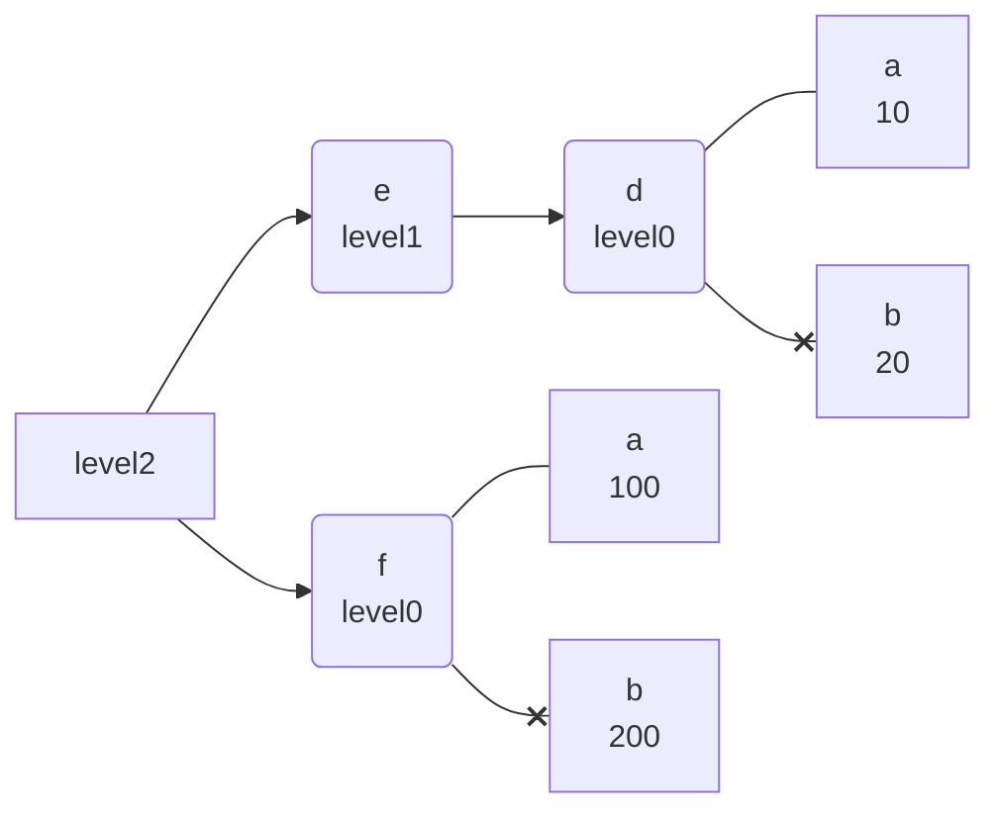

```mermaid
flowchart LR
    id15696277213149321320[level2]
    id15696277213149321320 --> id159132120600507116(e\nlevel1)
    id159132120600507116 --> id7500441386962467209(d\nlevel0)
    id7500441386962467209 --- id8292801017962660105["a\n10"]
    id7500441386962467209 --x id5855743171222414412["b\n20"]
    id15696277213149321320 --> id10009280772564895168(f\nlevel0)
    id10009280772564895168 --- id11951215191344350637["a\n100"]
    id10009280772564895168 --x id1196345851686744158["b\n200"]
```